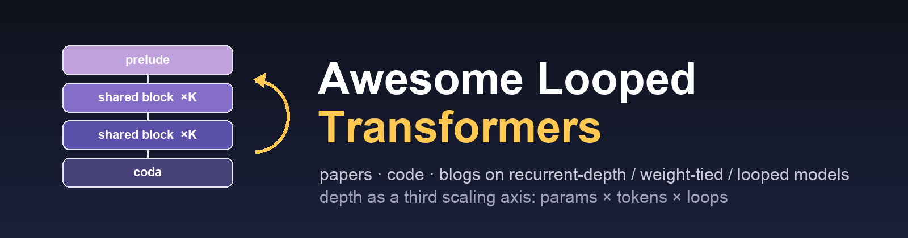

<div align="center">
  
</div>


<div align="center">


<br>


<br>


<br>


<br>


</div>

# When Transformers Loop

**Awesome Looped Transformers** is an awesome list summarising **papers, open-source code, models, and technical blogs** on **Looped Transformers** — also called *recurrent-depth*, *depth-recurrent*, *weight-tied*, *universal*, or *recursive* Transformers — the family of architectures that reuses the same block of layers several times inside one forward pass to buy **effective depth without extra parameters**.

 - 🎯 **Loop model = L1 + L2.** `L1`: within a *single forward pass*, a shared learned block (layer / stack / module) is applied more than once to the same hidden state. `L2`: the number of applications is a *compute knob* — fixed at train time, chosen at test time, or decided per token / per input by a halting rule. Methods that only partially satisfy this (e.g. repeated full-model calls, agent loops, latent chain-of-thought with untied layers) are flagged in **📝 Strictness notes** per section.
 - 🧭 **Why now.** Huginn (Feb 2025) showed recurrent-depth pretraining works at 3.5B; Ouro (Oct 2025) scaled it to 7.7T tokens; Loopie / Nanbeige4.2 / SMELT (2026) made looping compute-matched competitive with parameter scaling; and in Sep 2026 *The Information* reported that OpenAI's **Astra** uses recurrent depth. Depth-by-looping is now widely discussed as a **third scaling axis** next to parameters and tokens.
 - 🚀 Each entry is annotated along five design axes — **loop topology** (model-loop · layer-loop · sandwich `prelude → core×K → coda` · hierarchical two-timescale · fixed-point/DEQ), **depth control** (fixed K · train-time random K · ACT/halting gate · token router · convergence test), **input injection** (none · add · concat · attention-injection), **origin** (from scratch · retrofit of a pretrained LLM · training-free wrapper), and **scale** (toy/synthetic · ≤1B · 1–10B · MoE).
 - ⚠️ Built by reading arXiv abstracts / HTML, project pages, and repos with LLM coding agents; manually reviewed but errors possible. PRs welcome.
 - 📌 If you find this repository helpful for your research, please cite it via the **"Cite this repository"** button in the right sidebar of the GitHub page.
 - 📅 Last updated: 2026-09-04

Taxonomy:
 - **📚 Surveys, Foundations & Position Papers** — ACT, Universal Transformers, DEQ, Neural GPU, surveys on latent reasoning
 - **🧮 Theory & Expressivity** — what loops can compute; length generalization; approximation rates
 - **🔬 Mechanistic Analysis & Diagnostics** — what actually happens inside Huginn / Ouro / TRM across iterations
 - **🏗️ Pretrained Looped LMs** — language models trained from scratch with a looped core (Huginn, Ouro, Loopie, MoR, LoopFormer, …)
 - **⚖️ Stability, Residual Scaling & Scaling Laws** — why deep loops diverge and how to fix it; iso-FLOP / iso-depth laws
 - **🔀 Adaptive Depth** — halting, routing, early exit, per-token recursion
 - **🔁 Retrofitting Pretrained LLMs** — turn an existing feed-forward LLM into a looped one, with or without training
 - **⚡ Efficient Training & Serving** — KV cache across loops, depth batching, parallel loops, samplers
 - **🧠 Latent Reasoning Objectives** — trajectory rewards, latent CoT bridges, multi-token targets
 - **🧩 Recursive Reasoners** — HRM / TRM / equilibrium-model family on ARC / Sudoku / Maze
 - **🖼️🤖 Applications** — vision, VLA/robotics, multimodal, MT, speech, graphs, 3D
 - **🏭 Production Models & Reports** — what labs ship and what is reported about frontier models
 - **🛠️ Frameworks & Code** — what to actually run
 - **📰 Blogs, Threads & Talks** — long-form explainers, ablation write-ups, debates

Shorthand: **K** = number of loop iterations · **UT** = Universal Transformer · **ACT** = Adaptive Computation Time · **DEQ** = Deep Equilibrium Model · **HRM/TRM** = Hierarchical / Tiny Recursive Model · **MoR** = Mixture-of-Recursions · `📄 paper-only` = no public code yet.

> 📖 **Companion note:** [Types of Looped Transformers — a field guide](docs/looped-transformer-taxonomy.md) — the five loop topologies plus depth-control, injection and origin axes, with schematics and figures pulled from the 15 representative papers.

## Updates

<details>
<summary>📢 click to expand</summary>

- **2026-09-04** — initial release: ~160 papers, 22 code repos, 19 blogs/threads. Seeded from arXiv (`looped transformer`, `recurrent depth`, `universal transformer`, `weight-tied`), the GitHub `looped-transformers` / `recurrent-depth` topics, and cross-checked against [huskydoge/Awesome-Loop-Models](https://github.com/huskydoge/Awesome-Loop-Models). Includes the Sep 2026 OpenAI Astra coverage (Raschka, LessWrong) and the newest arXiv entries (SMELT, Jacobian Lens, Latent Recurrent Thoughts).

</details>

---

## 📚 Surveys, Foundations & Position Papers

| Resource | 🌟 Stars | Date | Org | Paper / Link | Title / Notes |
| :----: | :----: | :----: |  :----: | :----: | :---- |
| [Neural GPU](https://arxiv.org/abs/1511.08228) | [](https://arxiv.org/abs/1511.08228) | 2015.11 | Google Brain (Kaiser, Sutskever) | [arXiv 1511.08228](https://arxiv.org/abs/1511.08228) | **Neural GPUs Learn Algorithms** (ICLR 2016) — one shared convolutional-GRU block applied repeatedly; learns binary addition/multiplication that length-generalizes. The ancestor of "reuse a block, get an algorithm" |
| [ACT](https://arxiv.org/abs/1603.08983) | [](https://arxiv.org/abs/1603.08983) | 2016.03 | Google DeepMind (Graves) | [arXiv 1603.08983](https://arxiv.org/abs/1603.08983) | **Adaptive Computation Time for RNNs** (Seminal) — differentiable halting: the network learns how many shared-weight steps to run per input; the halting mechanism every later "adaptive depth" paper cites |
| [Universal Transformer](https://arxiv.org/abs/1807.03819) | [](https://arxiv.org/abs/1807.03819) | 2018.07 | Google Brain / DeepMind (Dehghani et al.) | [arXiv 1807.03819](https://arxiv.org/abs/1807.03819) | **Universal Transformers** (Seminal · ICLR 2019) — the canonical weight-tied Transformer: one attention+transition block iterated over depth with a per-position ACT halting; argued Turing-complete under stated assumptions |
| [DEQ](https://arxiv.org/abs/1909.01377) | [](https://arxiv.org/abs/1909.01377) | 2019.09 | CMU (Bai, Kolter, Koltun) | [arXiv 1909.01377](https://arxiv.org/abs/1909.01377) | **Deep Equilibrium Models** (Seminal · NeurIPS 2019) — the K→∞ limit of a weight-tied network: solve for the fixed point directly and differentiate implicitly with O(1) activation memory |
| [Multiscale DEQ](https://arxiv.org/abs/2006.08656) | [](https://arxiv.org/abs/2006.08656) | 2020.06 | CMU | [arXiv 2006.08656](https://arxiv.org/abs/2006.08656) | **Multiscale Deep Equilibrium Models** (NeurIPS 2020) — DEQ at ImageNet scale with synchronized equilibria across resolutions |
| [Parameter Sharing Lessons](https://arxiv.org/abs/2104.06022) | [](https://arxiv.org/abs/2104.06022) | 2021.04 | Takase & Kiyono | [arXiv 2104.06022](https://arxiv.org/abs/2104.06022) | **Lessons on Parameter Sharing across Layers in Transformers** — systematic study of *which* layers to tie (sequence / cycle / cycle-rev); the practical bridge between ALBERT-style sharing and looping |
| [Staircase Attention](https://arxiv.org/abs/2106.04279) | [](https://arxiv.org/abs/2106.04279) | 2021.06 | Meta FAIR (Ju, Roller, Sukhbaatar, Weston) | [arXiv 2106.04279](https://arxiv.org/abs/2106.04279) | **Staircase Attention for Recurrent Processing of Sequences** — recurrence over depth *and* time via a staircase of shared blocks; early "more compute per token vs more params" ablations |
| [On Training Implicit Models](https://arxiv.org/abs/2111.05177) | [](https://arxiv.org/abs/2111.05177) | 2021.11 | PKU / CMU (Geng, Bai, Lin) | [arXiv 2111.05177](https://arxiv.org/abs/2111.05177) | **On Training Implicit Models** (NeurIPS 2021) — phantom gradients: cheap approximate implicit differentiation for DEQ-style loops |
| [MoEUT](https://github.com/RobertCsordas/moeut) |  | 2024.05 | Stanford / Harvard (Csordás, Irie, Schmidhuber, Manning) | [arXiv 2405.16039](https://arxiv.org/abs/2405.16039) | **MoEUT: Mixture-of-Experts Universal Transformers** (NeurIPS 2024) — the first UT to match parameter-matched dense Transformers on LM: fine-grained MoE inside the shared block fixes the UT parameter-count bottleneck |
| [Latent Reasoning Survey](https://arxiv.org/abs/2507.06203) | [](https://arxiv.org/abs/2507.06203) | 2025.07 | UC Santa Cruz et al. (Zhu et al.) | [arXiv 2507.06203](https://arxiv.org/abs/2507.06203) | **A Survey on Latent Reasoning** — taxonomy of vertical (looped / recurrent-depth) vs horizontal (continuous-token) latent reasoning; written by the Ouro group |
| [Looped Models Done Right](https://ifm-research.notion.site/Towards-Looped-Models-Done-Right-3ade511912ec8128987dfeb7a5580043) | [](https://ifm-research.notion.site/Towards-Looped-Models-Done-Right-3ade511912ec8128987dfeb7a5580043) | 2026.07 | IFM (Huang, Shi, Chen, Wen, Liu, Xing, Ma) | [Notion](https://ifm-research.notion.site/Towards-Looped-Models-Done-Right-3ade511912ec8128987dfeb7a5580043) | **Towards Looped Models Done Right — Part I: Topology, Input Injection, Recurrent-State Design** — compute-matched ablations of recurrence topology / injection / state design at 730M dense and 8B-A0.8B MoE; favours the Huginn-style sandwich |
| [Compressed Loops vs CoT](https://arxiv.org/abs/2605.30757) | [](https://arxiv.org/abs/2605.30757) | 2026.05 | Haozhou Zhang | [arXiv 2605.30757](https://arxiv.org/abs/2605.30757) | **Chain-of-Thought and Compressed Looped Transformers: A Memory-Budget Separation** — position paper: loops with a compressed recurrent state stay bounded by that state's memory budget no matter how many steps, unlike a CoT scratchpad |

<details>
<summary>📝 <b>Strictness notes</b> (against the strict loop-model definition <code>L1: a shared block is reused within one forward pass</code> + <code>L2: the reuse count is a compute knob</code>)</summary>

- **Neural GPU** and **ACT** predate Transformers; they are kept as foundations because every ACT-style halting rule and every "learn an algorithm by iterating" argument descends from them.
- **DEQ** satisfies L1 (weight-tied) but replaces the explicit K with a root-finder; treat K→∞ as the compute knob.
- **Parameter Sharing Lessons** tie weights across positions in a fixed stack (no L2 knob); listed because it is the most-cited empirical guide to *which* layers to tie.
- **Latent Reasoning Survey** covers both looped and non-looped (Coconut-style continuous-token) latent reasoning; only its "vertical recurrence" half is strictly in scope.

</details>

---

## 🧮 Theory & Expressivity

| Resource | 🌟 Stars | Date | Org | Paper / Link | Title / Notes |
| :----: | :----: | :----: |  :----: | :----: | :---- |
| [Programmable Computers](https://github.com/jysohn1108/Looped-Transformer) |  | 2023.01 | UW–Madison (Giannou, Rajput, Sohn, Lee, Papailiopoulos) | [arXiv 2301.13196](https://arxiv.org/abs/2301.13196) | **Looped Transformers as Programmable Computers** (ICML 2023) — a constant-depth looped Transformer with an in-state program counter executes one instruction per loop; emulates a general-purpose computer, linear algebra, and in-context SGD |
| [Looped ICL](https://github.com/Leiay/looped_transformer) |  | 2023.11 | UW–Madison (Yang, Lee, Nowak, Papailiopoulos) | [arXiv 2311.12424](https://arxiv.org/abs/2311.12424) | **Looped Transformers are Better at Learning Learning Algorithms** (ICLR 2024) — input-injected looped TF matches a full Transformer on in-context regression with ~1/12 of the parameters and converges to task-specific fixed points |
| [Length Generalization](https://github.com/UW-Madison-Lee-Lab/looped-tf) |  | 2024.09 | UW–Madison / MIT (Fan, Du, Ramchandran, Lee) | [arXiv 2409.15647](https://arxiv.org/abs/2409.15647) | **Looped Transformers for Length Generalization** (ICLR 2025) — tasks expressible as *n* iterations of an RASP-L program are solved by looping *n* times; adaptive step count gives strong length extrapolation on arithmetic/algorithmic tasks |
| [Timestep Encoding](https://arxiv.org/abs/2410.01405) | [](https://arxiv.org/abs/2410.01405) | 2024.10 | U Tokyo (Xu, Sato) | [arXiv 2410.01405](https://arxiv.org/abs/2410.01405) | **On Expressive Power of Looped Transformers: Theoretical Analysis and Enhancement via Timestep Encoding** (ICML 2025) — approximation-rate bounds for looped TFs and the TMLT fix: modulate per-loop scale parameters by a timestep encoding |
| [Latent Thoughts](https://arxiv.org/abs/2502.17416) | [](https://arxiv.org/abs/2502.17416) | 2025.02 | Google Research (Saunshi, Dikkala, Li, Kumar, Reddi) | [arXiv 2502.17416](https://arxiv.org/abs/2502.17416) | **Reasoning with Latent Thoughts: On the Power of Looped Transformers** (ICLR 2025) — *k* loops of *L* layers ≈ *kL* effective depth for many reasoning problems; loops simulate latent CoT; looping acts as a regularizer that favours reasoning over memorization |
| [Implicit LMs are RNNs](https://arxiv.org/abs/2502.07827) | [](https://arxiv.org/abs/2502.07827) | 2025.02 | Schöne et al. | [arXiv 2502.07827](https://arxiv.org/abs/2502.07827) | **Implicit Language Models are RNNs: Balancing Parallelization and Expressivity** (ICML 2025) — iterate a shared SSM transition to a fixed point to recover RNN expressivity (state tracking) while keeping mostly-parallel training |
| [Halting vs Converging](https://arxiv.org/abs/2604.25551) | [](https://arxiv.org/abs/2604.25551) | 2026.04 | Hasselt U (Bollen, Vansummeren) | [arXiv 2604.25551](https://arxiv.org/abs/2604.25551) | **On Halting vs Converging in Recurrent Graph Neural Networks** — expressiveness relationships between converge-until-fixed-point and halt-by-rule recurrent GNNs; clean formal treatment of the two L2 knobs |
| [Stability & Generalization](https://arxiv.org/abs/2604.15259) | [](https://arxiv.org/abs/2604.15259) | 2026.04 | Asher Labovich | [arXiv 2604.15259](https://arxiv.org/abs/2604.15259) | **Stability and Generalization in Looped Transformers** — fixed-point framework characterising when recall + normalization make loop dynamics reachable, input-dependent and trainable |
| [Iso-Depth Scaling Laws](https://arxiv.org/abs/2604.21106) | [](https://arxiv.org/abs/2604.21106) | 2026.04 | TUM (Schwethelm, Rueckert, Kaissis) | [arXiv 2604.21106](https://arxiv.org/abs/2604.21106) | **How Much Is One Recurrence Worth? Iso-Depth Scaling Laws for Looped Language Models** — fits laws that price one extra recurrence in units of unique layers / training compute; the reference for "exchange rate" questions |
| [ICL Logistic Regression](https://arxiv.org/abs/2605.06609) | [](https://arxiv.org/abs/2605.06609) | 2026.05 | HKU (Zhang, Cao) | [arXiv 2605.06609](https://arxiv.org/abs/2605.06609) | **Transformers Efficiently Perform In-Context Logistic Regression via Normalized GD** — trains one attention layer and loops it: each loop is a normalized-gradient step, with convergence and OOD guarantees |
| [Power Method](https://arxiv.org/abs/2606.00605) | [](https://arxiv.org/abs/2606.00605) | 2026.05 | HKU (Wu, Zhang, Cao) | [arXiv 2606.00605](https://arxiv.org/abs/2606.00605) | **Looped Transformers with Layer Normalization Provably Learn the Power Method** — a looped linear TF + LN trained on PCA converges to the power iteration, one iteration per loop |
| [Bifurcation Models](https://arxiv.org/abs/2605.07277) | [](https://arxiv.org/abs/2605.07277) | 2026.05 | Jore, Liu | [arXiv 2605.07277](https://arxiv.org/abs/2605.07277) | **Bifurcation Models: Learning Set-Valued Solution Maps with Weight-Tied Dynamics** — weight-tied dynamics can represent multiple solution branches; diversity–accuracy trade-off |

---

## 🔬 Mechanistic Analysis & Diagnostics

| Resource | 🌟 Stars | Date | Org | Paper / Link | Title / Notes |
| :----: | :----: | :----: |  :----: | :----: | :---- |
| [Latent CoT?](https://arxiv.org/abs/2507.02199) | [](https://arxiv.org/abs/2507.02199) | 2025.07 | Brown / Harvard (Lu et al.) | [arXiv 2507.02199](https://arxiv.org/abs/2507.02199) | **Latent Chain-of-Thought? Decoding the Depth-Recurrent Transformer** (COLM 2025 WS) — logit-lens probes of Huginn find *little* evidence of a clean latent CoT across recurrences; interpretability depends on recurrence depth |
| [Two-Scale Dynamics](https://arxiv.org/abs/2509.23314) | [](https://arxiv.org/abs/2509.23314) | 2025.09 | Sapienza (Pappone, Crisostomi, Rodolà) | [arXiv 2509.23314](https://arxiv.org/abs/2509.23314) | **Two-Scale Latent Dynamics for Recurrent-Depth Transformers** — loop updates shrink and become increasingly orthogonal; a second-order early-exit criterion improves latency/quality |
| [Understanding Compute Allocation](https://arxiv.org/abs/2602.08864) | [](https://arxiv.org/abs/2602.08864) | 2026.02 | Penn State / MERL | [arXiv 2602.08864](https://arxiv.org/abs/2602.08864) | **Understanding Dynamic Compute Allocation in Recurrent Transformers** — controlled ANIRA framework: per-token depth aligns with token difficulty but fails to extrapolate to longer algorithmic inputs |
| [Tiny AR Recursive](https://arxiv.org/abs/2603.08082) | [](https://arxiv.org/abs/2603.08082) | 2026.03 | Cambridge (Rauba, Fanconi, van der Schaar) | [arXiv 2603.08082](https://arxiv.org/abs/2603.08082) | **Tiny Autoregressive Recursive Models** — under matched block-pass budgets, untied depth and flat two-stream recurrence beat a full autoregressive TRM on small algorithmic tasks; a useful negative result |
| [Loop, Think & Generalize](https://github.com/OSU-NLP-Group/Loop-Think-Generalize) |  | 2026.04 | Ohio State (Kohli, Parthasarathy, Sun, Yao) | [arXiv 2604.07822](https://arxiv.org/abs/2604.07822) | **Loop, Think, & Generalize: Implicit Reasoning in Recurrent-Depth Transformers** (COLM 2026) — iterating shared layers unlocks systematic generalization and *depth extrapolation* on multi-hop tasks; also documents overthinking when K exceeds the useful range |
| [Relational Preference Encoding](https://arxiv.org/abs/2604.09870) | [](https://arxiv.org/abs/2604.09870) | 2026.04 | Jan Kirin | [arXiv 2604.09870](https://arxiv.org/abs/2604.09870) | **Relational Preference Encoding in Looped Transformer Internal States** — probes frozen Ouro loop states on HH-RLHF; preference is decodable mainly from pairwise state differences |
| [Mechanistic Analysis](https://arxiv.org/abs/2604.11791) | [](https://arxiv.org/abs/2604.11791) | 2026.04 | Oxford / Mila (Blayney, Arroyo, Obando-Ceron, Castro, Courville) | [arXiv 2604.11791](https://arxiv.org/abs/2604.11791) | **A Mechanistic Analysis of Looped Reasoning Language Models** — across Huginn-0125, Ouro and MoR: many models approach *layer-specific cyclic fixed points*, and recurrent blocks re-enact feed-forward-like stages of inference; non-convergent cases documented |
| [Hierarchical vs Flat](https://arxiv.org/abs/2604.14442) | [](https://arxiv.org/abs/2604.14442) | 2026.04 | Sang-Il Han | [arXiv 2604.14442](https://arxiv.org/abs/2604.14442) | **Hierarchical vs. Flat Iteration in Shared-Weight Transformers** — two-speed hierarchical recurrence vs flat UT-style iteration at matched parameters; reports a 3.4-nat CE advantage for hierarchical with stated caveats |
| [UTs Need Memory](https://arxiv.org/abs/2604.21999) | [](https://arxiv.org/abs/2604.21999) | 2026.04 | Grigory Sapunov | [arXiv 2604.21999](https://arxiv.org/abs/2604.21999) | **Universal Transformers Need Memory: Depth-State Trade-offs in Adaptive Recursive Reasoning** — single-block UT + ACT on Sudoku-Extreme: learned memory tokens are required for non-trivial depth; bad ACT init traps the model at shallow depth |
| [Interaction Locality](https://arxiv.org/abs/2605.20784) | [](https://arxiv.org/abs/2605.20784) | 2026.05 | CyberAgent (Miyanishi, Morimura) | [arXiv 2605.20784](https://arxiv.org/abs/2605.20784) | **Interaction Locality in Hierarchical Recursive Reasoning** — measures how HRM/TRM recursive updates accumulate local writes into global solution structure on grid puzzles |
| [Emergent Specialization](https://arxiv.org/abs/2605.17811) | [](https://arxiv.org/abs/2605.17811) | 2026.05 | Rice (Shen, Su, Kyrillidis) | [arXiv 2605.17811](https://arxiv.org/abs/2605.17811) | **One Model, Two Roles: Emergent Specialization in a Shared Recurrent Transformer** — with asymmetric input injection, one shared model develops distinct proposal vs uncertainty roles for its L/H states |
| [Readout Blind Spot](https://arxiv.org/abs/2606.24898) | [](https://arxiv.org/abs/2606.24898) | 2026.06 | Virginia Tech (Sharma, Vu) | [arXiv 2606.24898](https://arxiv.org/abs/2606.24898) | **Dense Supervision Is Not Enough: The Readout Blind Spot in Looped Language Models** — per-loop supervision leaves intermediate states that the final readout cannot use; diagnoses a training blind spot in looped LMs |
| [Diagnosing Halting Gates](https://arxiv.org/abs/2607.20519) | [](https://arxiv.org/abs/2607.20519) | 2026.07 | Cambridge (Popescu, Sáez de Ocáriz Borde, Liò) | [arXiv 2607.20519](https://arxiv.org/abs/2607.20519) | **Adaptive Depth in Looped Transformers: Diagnosing Learned Halting Gates and Trajectory Readouts** — on synthetic tasks and Ouro-1.4B/2.6B, fixed-prior depth supervision yields better stopping signals than jointly learned halting gates |
| [Ignition at the Readout](https://arxiv.org/abs/2608.03263) | [](https://arxiv.org/abs/2608.03263) | 2026.08 | Simon Lam-Muir | [arXiv 2608.03263](https://arxiv.org/abs/2608.03263) | **The Ignition Is Real, and It Lives at the Readout** — iteration-by-iteration commitment in a recurrent-depth reasoner: a difficulty-clocked readout transition; companion: [Behaviour Is an Incomplete Measure](https://arxiv.org/abs/2608.16085) |
| [Dynamical Phase Selection](https://arxiv.org/abs/2608.26556) | [](https://arxiv.org/abs/2608.26556) | 2026.08 | Gunn Kim | [arXiv 2608.26556](https://arxiv.org/abs/2608.26556) | **Dynamical phase selection controls compute scaling in looped transformers** — identically accurate looped models can sit in different initialization-selected dynamical phases with different compute-scaling laws |
| [Jacobian Lens](https://arxiv.org/abs/2609.01924) | [](https://arxiv.org/abs/2609.01924) | 2026.09 | Fin AI Research / Intercom (Wang, Reid) | [arXiv 2609.01924](https://arxiv.org/abs/2609.01924) | **Looped Transformers under the Jacobian Lens: Does the Global Workspace Survive Recurrence?** — compares Ouro vs Huginn workspace dynamics under weight-tied virtual depth; recurrence preserves a causal workspace but reshapes how interventions propagate |

<details>
<summary>📝 <b>Strictness notes</b></summary>

- Most of this section studies **Huginn-0125**, **Ouro**, **MoR** or **TRM** checkpoints — read the results as model-specific unless the paper explicitly generalises.
- **Latent CoT?** and **Tiny AR Recursive** are *negative* results; they are listed on purpose.
- **Understanding Compute Allocation** and **Diagnosing Halting Gates** are about the L2 knob (adaptive depth) rather than the loop itself; cross-listed conceptually with 🔀 Adaptive Depth.

</details>

---

## 🏗️ Pretrained Looped LMs

Language models whose looped core was trained **from scratch** (dense or MoE), plus the architecture papers that define the modern design space.

| Resource | 🌟 Stars | Date | Org | Paper / Link | Title / Notes |
| :----: | :----: | :----: |  :----: | :----: | :---- |
| [CoTFormer](https://arxiv.org/abs/2310.10845) | [](https://arxiv.org/abs/2310.10845) | 2023.10 | EPFL (Mohtashami, Pagliardini, Jaggi) | [arXiv 2310.10845](https://arxiv.org/abs/2310.10845) | **CoTFormer: A Chain-of-Thought Driven Architecture with Budget-Adaptive Computation Cost** (ICLR 2024) — repeats a shared block while letting later repeats attend to earlier ones (mimicking CoT), with a learned token router for budgeted inference |
| [AlgoFormer](https://arxiv.org/abs/2402.13572) | [](https://arxiv.org/abs/2402.13572) | 2024.02 | HKU / Huawei (Gao et al.) | [arXiv 2402.13572](https://arxiv.org/abs/2402.13572) | **AlgoFormer** (TMLR) — the pre / loop / post three-stage split (a.k.a. sandwich) shown to beat vanilla looping on algorithmic and language tasks |
| [Huginn](https://github.com/seal-rg/recurrent-pretraining) |  | 2025.02 | UMD / ELLIS Tübingen / LLNL (Geiping, McLeish, … Goldstein) | [arXiv 2502.05171](https://arxiv.org/abs/2502.05171) · [HF](https://huggingface.co/tomg-group-umd/huginn-0125) | **Scaling up Test-Time Compute with Latent Reasoning: A Recurrent Depth Approach** (NeurIPS 2025) — the modern reference: 3.5B params, 800B tokens, prelude → recurrent core (random K≈32 at train, unroll to any K at test) → coda; input injection; zero-shot adaptive compute and KV sharing |
| [MoR](https://github.com/raymin0223/mixture_of_recursions) |  | 2025.07 | KAIST / Google DeepMind (Bae et al.) | [arXiv 2507.10524](https://arxiv.org/abs/2507.10524) | **Mixture-of-Recursions: Learning Dynamic Recursive Depths for Adaptive Token-Level Computation** (NeurIPS 2025) — one shared stack, a router picks each token's recursion depth, attention/KV restricted to tokens still active at that depth; same throughput budget, better perplexity |
| [Ouro](https://huggingface.co/ByteDance/Ouro-2.6B) | [](https://huggingface.co/ByteDance/Ouro-2.6B) | 2025.10 | ByteDance Seed / UCSC et al. (Zhu et al.) | [arXiv 2510.25741](https://arxiv.org/abs/2510.25741) · [project](https://ouro-llm.github.io/) | **Scaling Latent Reasoning via Looped Language Models** — 1.4B / 2.6B LoopLMs pretrained on 7.7T tokens with 4 loops and an entropy-regularised learned exit; 2.6B matches up-to-12B dense models on reasoning; the first industrial-scale open looped LM |
| [PLT](https://arxiv.org/abs/2510.24824) | [](https://arxiv.org/abs/2510.24824) | 2025.10 | ByteDance Seed (Wu, Chen, … Yan) | [arXiv 2510.24824](https://arxiv.org/abs/2510.24824) | **Parallel Loop Transformer for Efficient Test-Time Computation Scaling** — runs loop *k* of token *t* in parallel with loop *k−1* of token *t+1* and shares KV across loops, so looped accuracy costs ~no extra latency |
| [Think-at-Hard](https://arxiv.org/abs/2511.08577) | [](https://arxiv.org/abs/2511.08577) | 2025.11 | Tsinghua / Infinigence (Fu et al.) | [arXiv 2511.08577](https://arxiv.org/abs/2511.08577) | **Think-at-Hard: Selective Latent Iterations to Improve Reasoning Language Models** (ICML 2026) — a learned decider triggers extra latent iterations only on hard tokens, with LoRA refiners and duo-causal attention across iteration depth |
| [URM](https://arxiv.org/abs/2512.14693) | [](https://arxiv.org/abs/2512.14693) | 2025.12 | Ubiquant (Gao et al.) | [arXiv 2512.14693](https://arxiv.org/abs/2512.14693) | **Universal Reasoning Model** — weight-tied UT-style reasoning model; precursor to Loopie from the same group |
| [Dreamer](https://arxiv.org/abs/2601.21582) | [](https://arxiv.org/abs/2601.21582) | 2026.01 | Aleph Alpha Research / TUM | [arXiv 2601.21582](https://arxiv.org/abs/2601.21582) | **Depth-Recurrent Attention Mixtures: Giving Latent Reasoning the Attention it Deserves** — mixes sequence attention, *depth* attention (across loop states), and sparse expert attention; beats FLOP-/param-/memory-matched baselines on reasoning |
| [ChainGPT / MoDr](https://openreview.net/forum?id=kdZbxizwGK) | [](https://openreview.net/forum?id=kdZbxizwGK) | 2026.01 | Zheng et al. / Zhang et al. | [ChainGPT](https://openreview.net/forum?id=kdZbxizwGK) · [MoDr](https://openreview.net/forum?id=9Pba4rcQbE) (ICLR 2026) | **ChainGPT: Dual-Reasoning Model with Recurrent Depth and Multi-Rank State Updates** · **MoDr: Mixture-of-Depth-Recurrent Transformers for Test-Time Reasoning** — two ICLR-2026 recurrent-depth variants (multi-substep state updates + state-guided sparse attention; multi-branch routing over a depth-recurrent core) |
| [LoopFormer](https://github.com/armenjeddi/loopformer) |  | 2026.02 | Vector Institute / U Toronto (Jeddi, Ciccone, Taati) | [arXiv 2602.11451](https://arxiv.org/abs/2602.11451) · [project](https://loopformer.github.io/) | **LoopFormer: Elastic-Depth Looped Transformers for Latent Reasoning via Shortcut Modulation** (ICLR 2026) — trains on variable-length trajectories with time/step-size conditioning and a shortcut-consistency loss, so one model serves any compute budget without retraining |
| [SpiralFormer](https://arxiv.org/abs/2602.11698) | [](https://arxiv.org/abs/2602.11698) | 2026.02 | Yu et al. | [arXiv 2602.11698](https://arxiv.org/abs/2602.11698) | **SpiralFormer: Looped Transformers Can Learn Hierarchical Dependencies via Multi-Resolution Recursion** — shared layers applied under a multi-resolution recursion schedule |
| [MOUE](https://arxiv.org/abs/2603.04971) | [](https://arxiv.org/abs/2603.04971) | 2026.03 | CAS / Baidu (Chen, Gu, Shang, …) | [arXiv 2603.04971](https://arxiv.org/abs/2603.04971) | **Mixture of Universal Experts: Scaling Virtual Width via Depth-Width Transformation** — a layer-agnostic expert pool reused across depth turns depth into "virtual width" under a fixed activation budget |
| [Hyperloop](https://arxiv.org/abs/2604.21254) | [](https://arxiv.org/abs/2604.21254) | 2026.04 | MIT (Zeitoun, Torroba-Hennigen, Kim) | [arXiv 2604.21254](https://arxiv.org/abs/2604.21254) | **Hyperloop Transformers** — begin / middle / end blocks with only the middle looped, plus *hyper-connections* between loop iterations; parameter- and memory-efficient LM |
| [Sparse Layers Critical](https://arxiv.org/abs/2605.09165) | [](https://arxiv.org/abs/2605.09165) | 2026.05 | USC ISI / Netflix (Lee, Biloki, Hu, May) | [arXiv 2605.09165](https://arxiv.org/abs/2605.09165) | **Sparse Layers are Critical to Scaling Looped Language Models** — MoE layers inside the loop scale better than dense loops: routing diverges across repeats (recovering expressivity) and loop boundaries make natural early exits |
| [LoopMoE](https://arxiv.org/abs/2606.04438) | [](https://arxiv.org/abs/2606.04438) | 2026.06 | HKUST(GZ) / Huawei | [arXiv 2606.04438](https://arxiv.org/abs/2606.04438) | **LoopMoE: Unifying Iterative Computation with Mixture-of-Experts for Language Modeling** — iteration-conditioned modulation + capacity balancing for a looped MoE |
| [Tying the Loop](https://arxiv.org/abs/2606.16825) | [](https://arxiv.org/abs/2606.16825) | 2026.06 | EPFL (Jaggi) | [arXiv 2606.16825](https://arxiv.org/abs/2606.16825) | **Tying the Loop — Tied Expert Layers in Mixture-of-Experts Language Models** — tie the expert layers across depth; a compact study of where sharing helps in MoE LMs |
| [Loopie](https://arxiv.org/abs/2607.16051) | [](https://arxiv.org/abs/2607.16051) | 2026.07 | IQuest Lab / Ubiquant (Gao, Chen, Xiao, … Dai) | [arXiv 2607.16051](https://arxiv.org/abs/2607.16051) · [HF paper page](https://huggingface.co/papers/2607.16051) | **Loop the Loopies!** — Loopie-20B-A2B and 6B-A0.6B MoE with *layer-loop* recurrence (each layer applied twice before moving on) and a compute-matched "Loopie recipe"; claims a 30B-A3B vanilla MoE is beaten after ~600B tokens and IMO/IPhO-2025 gold without tools after post-training |
| [RecurrentGPT](https://arxiv.org/abs/2608.15062) | [](https://arxiv.org/abs/2608.15062) | 2026.08 | GUC / TUM / Cerebras (Hegazy, Alanwar, Elhoushi) | [arXiv 2608.15062](https://arxiv.org/abs/2608.15062) | **Gated Recurrent Transformers: Expressive Depth through Recurrent Modulation** — prelude-shared-coda with a gated shared core; matches 12-layer GPT-2 Small with 3 distinct layers under isoFLOPs |
| [RecursiveGPT](https://arxiv.org/abs/2608.26973) | [](https://arxiv.org/abs/2608.26973) | 2026.08 | TUM (Gülbahar, Edman, Fraser) | [arXiv 2608.26973](https://arxiv.org/abs/2608.26973) | **Squeezing More from Limited Data with Recursive Transformers** — reuse one causal block at fixed recurrent depth with factorized embeddings; wins in the *data-limited* pretraining regime |
| [SMELT](https://arxiv.org/abs/2609.01343) | [](https://arxiv.org/abs/2609.01343) | 2026.09 | Tsinghua / ByteDance Seed / M-A-P (Wang, Zhang, …) | [arXiv 2609.01343](https://arxiv.org/abs/2609.01343) | **SMELT: Scaling Laws for Compute-Matched MoE Looped Transformers** — a sparse MoE that applies its *middle half* of layers twice; improved scaling and downstream results at equal per-token FLOPs, non-embedding params and KV size |

<details>
<summary>📋 Click to view technical details</summary>

| Resource | Loop topology | Depth control | Input injection | Origin | Scale | Notes |
| :----: | :----: | :----: | :----: | :----: | :----: | :---- |
| Huginn | sandwich (2 prelude / 4-layer core / 2 coda) | random K at train (log-normal-Poisson), any K at test; optional KL-based early exit | adds embedded input every loop | scratch | 3.5B dense, 800B tok | truncated BPTT (last 8 loops); random-initialised state each pass |
| MoR | flat shared stack | per-token router (expert-choice or token-choice), max depth N_r | none | scratch | 135M–1.7B | recursion-wise KV caching / KV sharing |
| Ouro | flat loop of full stack | fixed 4 loops + entropy-regularised learned exit gate | none | scratch | 1.4B / 2.6B dense, 7.7T tok | 8-loop runs were unstable, hence 4; running past trained depth hurts |
| PLT | flat loop | fixed K | none | scratch | ≤1B | cross-loop parallelism + gated sliding-window attention; shares KV across loops |
| Loopie | *layer*-loop (each MoE layer ×2) | fixed K=2 | none | scratch | 20B-A2B MoE, 3.5T tok | "loops beat params" only after ~600B tok; shows compute-matched (not just param-matched) wins |
| LoopFormer | flat loop | any K at test (time-conditioned, shortcut-consistency) | step/time conditioning | scratch | ≤1B | one model serves every budget |
| Hyperloop | sandwich | fixed K | hyper-connections across loops | scratch | ≤1B | memory-efficient |
| SMELT | middle-half re-applied ×2 | fixed K=2 | none | scratch | MoE, compute-matched | KV cache size unchanged |
| Dreamer | flat loop + depth attention | fixed K | attention over past loop states | scratch | ≤1B | attends across depth as well as sequence |

</details>

<details>
<summary>📝 <b>Strictness notes</b></summary>

- **Ouro** exposes `total_ut_steps` in its HF config; note the community [KV-cache fix](https://github.com/Antizana/ouro-cache-fix) for `Ouro-1.4B` generation.
- **Loopie**'s paper links Megatron-LM / vLLM forks under `IQuestLab/loopie` and HF weights under `IQuestLab/Loopie-20B-A2B`; both were still non-public at listing time (2026-09-04) — treat it as `📄 paper-only` until they open.
- **ChainGPT / MoDr** are ICLR 2026 OpenReview papers without arXiv IDs at listing time; OpenReview links given.
- **PLT** is an inference-efficiency design as much as a pretrained model; cross-listed in ⚡ Efficient Training & Serving.

</details>

---

## ⚖️ Stability, Residual Scaling & Scaling Laws

| Resource | 🌟 Stars | Date | Org | Paper / Link | Title / Notes |
| :----: | :----: | :----: |  :----: | :----: | :---- |
| [SCORE](https://arxiv.org/abs/2603.10544) | [](https://arxiv.org/abs/2603.10544) | 2026.03 | Guillaume Godin | [arXiv 2603.10544](https://arxiv.org/abs/2603.10544) | **SCORE: Replacing Layer Stacking with Contractive Recurrent Depth** — enforce a contractive recurrent block so that iterating is provably stable |
| [Thinking Deeper, Not Longer](https://arxiv.org/abs/2603.21676) | [](https://arxiv.org/abs/2603.21676) | 2026.03 | National Central U (Chen) | [arXiv 2603.21676](https://arxiv.org/abs/2603.21676) | **Depth-Recurrent Transformers for Compositional Generalization** — silent thinking + LayerScale + identity-biased recurrence for stable deep latent iteration |
| [Parcae](https://arxiv.org/abs/2604.12946) | [](https://arxiv.org/abs/2604.12946) | 2026.04 | UCSD / Together AI (Prairie, Novack, Berg-Kirkpatrick, Fu) | [arXiv 2604.12946](https://arxiv.org/abs/2604.12946) | **Parcae: Scaling Laws For Stable Looped Language Models** (LIT WS @ ICLR 2026) — constrain the spectral norm of the input-injection path to stop divergence at large K; isoFLOP train- and test-time scaling laws at fixed parameters. See the [Exact-ZOH follow-up blog](https://huskydoge.github.io/husky-blog/posts/recursive_models/improve-parcae/) |
| [Fully Looped](https://arxiv.org/abs/2605.18797) | [](https://arxiv.org/abs/2605.18797) | 2026.05 | HKBU / Jilin U (Fu et al.) | [arXiv 2605.18797](https://arxiv.org/abs/2605.18797) | **Simply Stabilizing the Loop via Fully Looped Transformer** — parameter-free fully looped signal routing + attention injection; trains stably at higher loop counts while keeping test-time K control |
| [STARS](https://arxiv.org/abs/2605.26733) | [](https://arxiv.org/abs/2605.26733) | 2026.05 | Nanjing U (Yang et al.) | [arXiv 2605.26733](https://arxiv.org/abs/2605.26733) | **Stabilizing Recurrent Dynamics for Test-Time Scalable Latent Reasoning in Looped LMs** (ICML 2026) — diagnoses collapse at large K; Jacobian spectral-radius regularisation + random loop sampling restores test-time scaling |
| [CART](https://arxiv.org/abs/2606.01495) | [](https://arxiv.org/abs/2606.01495) | 2026.05 | Chad A. Capps | [arXiv 2606.01495](https://arxiv.org/abs/2606.01495) | **CART: Context-Anchored Recurrent Transformer** — anchor recurrence to precomputed KV tensors for learned stability; reports a *mostly negative* parameter-parity result vs dense — worth reading for calibration |
| [Residual Scaling](https://arxiv.org/abs/2606.18524) | [](https://arxiv.org/abs/2606.18524) | 2026.06 | Tsinghua / ByteDance Seed / M-A-P (Wang, Li, Zhang, Huang, Yan, Li) | [arXiv 2606.18524](https://arxiv.org/abs/2606.18524) | **On the Residual Scaling of Looped Transformers: Stability and Transferability** — correlated shared-block updates need 1/N residual scaling in loop count; enables hyperparameter transfer from small to large recurrent depth |
| [Stochastic Stopping](https://arxiv.org/abs/2606.29983) | [](https://arxiv.org/abs/2606.29983) | 2026.06 | EPFL / MPI-IS Tübingen (Kuo, Chayti, Reizinger, Brendel) | [arXiv 2606.29983](https://arxiv.org/abs/2606.29983) | **Stabilizing Extrapolation in Looped Transformers via Learned Stochastic Stopping** — stochastic train-time K and learned stochastic stopping cut OOD variance across inference loop counts |
| [DeepLoop](https://github.com/yifanzhang-pro/DeepLoop) |  | 2026.07 | Princeton / UCLA (Li, Zhang, Guo, Gu, Wang) | [arXiv 2607.13491](https://arxiv.org/abs/2607.13491) · [project](https://yifanzhang-pro.github.io/DeepLoop/) | **DeepLoop: Depth Scaling for Looped Transformers** — a residual-scaling rule that accounts for the same physical block being revisited, stabilising many recurrent rounds |
| [Think Shallow, Solve Deep](https://arxiv.org/abs/2608.18222) | [](https://arxiv.org/abs/2608.18222) | 2026.08 | Viakhirev et al. | [arXiv 2608.18222](https://arxiv.org/abs/2608.18222) | **Controlling Recurrent Dynamics for Reliable Test-Time Depth** — classifies recurrent operators as settling / marginal / drifting, derives a depth-safety condition, and links a terminal fixed-point objective to stable depth extrapolation |

<details>
<summary>📝 <b>Strictness notes</b></summary>

- Also relevant here but listed elsewhere: **Iso-Depth Scaling Laws** (🧮), **Loopie recipe** (🏗️), **SMELT** (🏗️), **LayerNorm as Implicit Gain Control** ([arXiv 2607.10681](https://arxiv.org/abs/2607.10681), independent), and the FLOPs/memory ablation blog in 📰.
- The recurring finding across Ouro, STARS, Parcae and Think Shallow: **running past the trained K hurts unless the recurrent map is contractive / regularised** — treat "free test-time scaling" claims with that caveat.

</details>

---

## 🔀 Adaptive Depth: Halting, Routing & Early Exit

| Resource | 🌟 Stars | Date | Org | Paper / Link | Title / Notes |
| :----: | :----: | :----: |  :----: | :----: | :---- |
| [CoLa](https://arxiv.org/abs/2507.07996) | [](https://arxiv.org/abs/2507.07996) | 2025.07 | UMD / MBZUAI (Li, Li, Zhou) | [arXiv 2507.07996](https://arxiv.org/abs/2507.07996) | **Skip a Layer or Loop it? Test-Time Depth Adaptation of Pretrained LLMs** — Chain-of-Layers: MCTS over per-sample programs that skip or repeat pretrained layers; shows repeats help accuracy with zero training |
| [Program-of-Layers](https://arxiv.org/abs/2606.06574) | [](https://arxiv.org/abs/2606.06574) | 2026.06 | UMD / MBZUAI (Li, Li, Zhou) | [arXiv 2606.06574](https://arxiv.org/abs/2606.06574) | **Skip a Layer or Loop It? Learning Program-of-Layers in LLMs** (ICML 2026) — the learned successor to CoLa: input-specific layer programs with skips and loops |
| [AdaPonderLM](https://arxiv.org/abs/2603.01914) | [](https://arxiv.org/abs/2603.01914) | 2026.03 | SJTU LUMIA (Song et al.) | [arXiv 2603.01914](https://arxiv.org/abs/2603.01914) | **Gated Pondering Language Models with Token-Wise Adaptive Depth** — token-wise halting gates + KV reuse; more loops on hard tokens under a fixed budget |
| [Adaptive Loops & Memory](https://arxiv.org/abs/2603.08391) | [](https://arxiv.org/abs/2603.08391) | 2026.03 | Fraunhofer IAIS / Bonn (Frey, Shomali, …) | [arXiv 2603.08391](https://arxiv.org/abs/2603.08391) | **Adaptive Loops and Memory in Transformers: Think Harder or Know More?** (LIT WS @ ICLR 2026) — per-layer adaptive looping + gated memory banks; both together win at matched params/FLOPs |
| [Sparse Growing](https://arxiv.org/abs/2603.23998) | [](https://arxiv.org/abs/2603.23998) | 2026.03 | Chen et al. | [arXiv 2603.23998](https://arxiv.org/abs/2603.23998) | **Sparse Growing Transformer: Training-Time Sparse Depth Allocation via Progressive Attention Looping** — grow depth by looping attention progressively during training |
| [AdaR (graphs)](https://arxiv.org/abs/2606.22462) | [](https://arxiv.org/abs/2606.22462) | 2026.06 | CAS (Sun, Chang, Huang, Wang) | [arXiv 2606.22462](https://arxiv.org/abs/2606.22462) | **Adaptive Recurrent Message Passing for Test Time Computing on Graphs** (ICML 2026) — step-conditioned recurrent message passing; test-time compute on graphs without changing parameters |
| [FPRM](https://github.com/nilskiKonjIzDunava/fprm) |  | 2026.06 | ELLIS Tübingen / MPI-IS (Movahedi, Milovanović, …) | [arXiv 2606.18206](https://arxiv.org/abs/2606.18206) | **Fixed-Point Reasoners: Stable and Adaptive Deep Looped Transformers** — use fixed-point *convergence* as the halting signal; adapts test-time compute to difficulty on Sudoku / Maze / ARC-AGI |
| [Exit-State SSMs](https://arxiv.org/abs/2607.10110) | [](https://arxiv.org/abs/2607.10110) | 2026.07 | U Tokyo (Yu, Kojima, Matsuo, Iwasawa) | [arXiv 2607.10110](https://arxiv.org/abs/2607.10110) | **Looped State-Space Language Models with Adaptive Exit-State Selection** — loop shared Mamba / hybrid blocks and pick among exit states |
| [LoopMTP](https://arxiv.org/abs/2608.03624) | [](https://arxiv.org/abs/2608.03624) | 2026.08 | Bonn / Fraunhofer IAIS (Shomali et al.) | [arXiv 2608.03624](https://arxiv.org/abs/2608.03624) | **LoopMTP: A looped transformer guided by latent multi-token prediction** — soft MTP targets guide each reuse; learned aggregation over loop states reduces latent overthinking |
| [Continuous Depth Batching](https://arxiv.org/abs/2608.09444) | [](https://arxiv.org/abs/2608.09444) | 2026.08 | TUM (Schwethelm, Rueckert, Kaissis) | [arXiv 2608.09444](https://arxiv.org/abs/2608.09444) | **Depth-adaptive Inference of Looped LMs via Continuous Depth Batching** — schedule loop iterations and boundary stages separately so adaptive depth actually realises its theoretical speed-up in serving |
| [Readout Feedback](https://arxiv.org/abs/2608.24136) | [](https://arxiv.org/abs/2608.24136) | 2026.08 | Kamiya, Koyama et al. | [arXiv 2608.24136](https://arxiv.org/abs/2608.24136) | **Steering Recurrent Reasoners at Inference Time with Readout Feedback** — turn intermediate predictions into coupling forces on the latent dynamics; training-free test-time steering |
| [Recirculation](https://arxiv.org/abs/2608.17981) | [](https://arxiv.org/abs/2608.17981) | 2026.08 | Google DeepMind / UT Austin (Mozer, Siddiqui, Sawyer, Sanyal) | [arXiv 2608.17981](https://arxiv.org/abs/2608.17981) | **Recirculation** — feed a mixture of deep-layer activations back into shallower layers of the same frozen stack; training-free recurrent state tracking with an adaptive inference-time variant |

<details>
<summary>📋 Click to view technical details</summary>

| Resource | Halting rule | Granularity | Needs training? | Notes |
| :----: | :----: | :----: | :----: | :---- |
| ACT / UT | cumulative halting probability ≥ 1−ε | per position | yes (ponder cost) | the original |
| MoR | router (expert-choice / token-choice) | per token | yes | KV restricted to active tokens |
| Ouro | learned exit gate w/ entropy regulariser | per token | yes | trained jointly with LM |
| Huginn | KL between consecutive loop outputs | per sequence / token | no (zero-shot) | also supports fixed K |
| FPRM | fixed-point convergence test | per input | yes | halting = convergence |
| CoLa / Program-of-Layers | MCTS search / learned program | per sample | no / yes | operates on *untied* pretrained layers |
| AdaPonderLM | token-wise gate | per token | yes | KV reuse across loops |
| LoopFormer | user-chosen K (budget) | global | trained for any K | shortcut consistency |

</details>

<details>
<summary>📝 <b>Strictness notes</b></summary>

- **CoLa / Program-of-Layers / Recirculation** loop *untied* pretrained layers; they satisfy L1 (a block is reused) but the reused block is not weight-tied by design — flagged as the "loop-a-pretrained-model" family, cross-listed with 🔁 Retrofitting.
- **Diagnosing Halting Gates** (🔬) is the main empirical caution: jointly learned halting gates were *worse* than fixed-prior depth supervision on Ouro checkpoints.

</details>

---

## 🔁 Retrofitting Pretrained LLMs into Loops

Start from an existing feed-forward LLM and make it loop — with continued training, adapters, or no training at all.

| Resource | 🌟 Stars | Date | Org | Paper / Link | Title / Notes |
| :----: | :----: | :----: |  :----: | :----: | :---- |
| [Relaxed Recursive TF](https://github.com/avramdj/rrt-lora) |  | 2024.10 | KAIST / Google DeepMind (Bae, Fisch, Harutyunyan, …) | [arXiv 2410.20672](https://arxiv.org/abs/2410.20672) | **Relaxed Recursive Transformers: Effective Parameter Sharing with Layer-wise LoRA** (ICLR 2025) — convert Gemma/TinyLlama into a looped block + per-depth LoRA deltas; proposes continuous depth-wise batching (2–3× simulated throughput). Community reimplementation linked |
| [Encode-Think-Decode](https://arxiv.org/abs/2510.07358) | [](https://arxiv.org/abs/2510.07358) | 2025.10 | Meta FAIR / UCL (Koishekenov, Lipani, Cancedda) | [arXiv 2510.07358](https://arxiv.org/abs/2510.07358) | **Encode, Think, Decode: Scaling test-time reasoning with recursive latent thoughts** (ICLR 2026) — identify a small set of reasoning-relevant middle layers in a pretrained LLM and iterate only those during mid-training |
| [Retrofitted Recurrence](https://github.com/mcleish7/retrofitting-recurrence) |  | 2025.11 | UMD (McLeish, Li, Kirchenbauer, … Goldstein) | [arXiv 2511.07384](https://arxiv.org/abs/2511.07384) | **Teaching Pretrained Language Models to Think Deeper with Retrofitted Recurrence** — the Huginn group's recipe for uptraining feed-forward LMs into depth-recurrent ones; beats continued post-training of the original at matched compute on math |
| [LoopUS](https://arxiv.org/abs/2605.11011) | [](https://arxiv.org/abs/2605.11011) | 2026.05 | Pusan National U | [arXiv 2605.11011](https://arxiv.org/abs/2605.11011) | **LoopUS: Recasting Pretrained LLMs into Looped Latent Refinement Models** — split into encoder / looped block / decoder; selective gating, random deep supervision and adaptive early exit stabilise the loop |
| [Training-Free Looped TF](https://arxiv.org/abs/2605.23872) | [](https://arxiv.org/abs/2605.23872) | 2026.05 | UT Austin / Google (Chen, Li, Liang, Lao, Liu) | [arXiv 2605.23872](https://arxiv.org/abs/2605.23872) | **Training-Free Looped Transformers** — an inference wrapper that re-applies a contiguous mid-stack block as damped refinement sub-steps; improves several QA/reasoning benchmarks with no fine-tuning |
| [MELT](https://arxiv.org/abs/2605.07721) | [](https://arxiv.org/abs/2605.07721) | 2026.05 | Qualcomm AI Research | [arXiv 2605.07721](https://arxiv.org/abs/2605.07721) | **Memory-Efficient Looped Transformer: Decoupling Compute from Memory** — one fixed-size KV cache per layer shared across loops with learned gating; adapts pretrained Ouro so cache memory is independent of K |
| [CHERRY](https://arxiv.org/abs/2606.31796) | [](https://arxiv.org/abs/2606.31796) | 2026.06 | Kwon, Park | [arXiv 2606.31796](https://arxiv.org/abs/2606.31796) | **Compressed Hierarchical Experts with Recurrent Representational Yield** — compress a 48-layer LM to 6 layers and restore depth by learned recurrent unrolling; use several such models as experts |
| [Retrofitting at Two Budgets](https://arxiv.org/abs/2608.11233) | [](https://arxiv.org/abs/2608.11233) | 2026.07 | Mark Shapiro | [arXiv 2608.11233](https://arxiv.org/abs/2608.11233) | **Retrofitting Recurrent Depth into a Pretrained LM: Installation, Extrapolation, Transfer, and Retention** — Qwen2.5-0.5B + weight-tied middle block + re-entry bridge, at full-block and frozen-base adapter budgets |
| [ReLIT](https://arxiv.org/abs/2608.08113) | [](https://arxiv.org/abs/2608.08113) | 2026.08 | Panwar, Singh, Bansal | [arXiv 2608.08113](https://arxiv.org/abs/2608.08113) | **Think Deep, Speak Once: ReLIT, A Recursive Latent Implicit Transformer Framework** — a small trainable recursive latent block on top of a frozen backbone |
| [Full-bandwidth TF](https://arxiv.org/abs/2608.08888) | [](https://arxiv.org/abs/2608.08888) | 2026.08 | JHU / Princeton / Microsoft (Wang et al.) | [arXiv 2608.08888](https://arxiv.org/abs/2608.08888) | **Full-bandwidth transformer** — feed each decoding step's top hidden state back through a gate at the bottom of the same stack, widening autoregressive feedback from a token to a full latent |
| [Latent Recurrent Thoughts](https://arxiv.org/abs/2609.01117) | [](https://arxiv.org/abs/2609.01117) | 2026.09 | Chen, Fu | [arXiv 2609.01117](https://arxiv.org/abs/2609.01117) | **Recurrent Refinement of Proposed Latents for Reasoning with Frozen LLMs** — a latent proposer + tiny TRM-style recurrent refiner in front of a frozen LLM decoder |

<details>
<summary>📋 Click to view technical details</summary>

| Resource | What is looped | Weights tied? | Extra params | Training | Base model |
| :----: | :----: | :----: | :----: | :----: | :---- |
| Relaxed Recursive TF | one block of L/k layers | yes + per-depth LoRA | LoRA | uptraining | Gemma 2B, TinyLlama |
| Encode-Think-Decode | chosen middle layers | yes | none | mid-training | OLMo family |
| Retrofitted Recurrence | middle block | yes | none | continued pretraining | Qwen / Llama-style |
| LoopUS | middle block | yes | gates | fine-tune | pretrained LLMs |
| Training-Free Looped TF | contiguous mid block | yes (frozen) | none | **none** | frozen LLMs |
| MELT | Ouro's loop | yes | KV gating | chunk-wise 2-phase | Ouro |
| CoLa / Recirculation (🔀) | arbitrary layers | no (untied) | none | none | Llama / Gemma |

</details>

---

## ⚡ Efficient Training & Serving

| Resource | 🌟 Stars | Date | Org | Paper / Link | Title / Notes |
| :----: | :----: | :----: |  :----: | :----: | :---- |
| [Parallel Samplers](https://arxiv.org/abs/2510.14961) | [](https://arxiv.org/abs/2510.14961) | 2025.10 | ELLIS Tübingen / MPI-IS (Geiping, Yang, Su, …) | [arXiv 2510.14961](https://arxiv.org/abs/2510.14961) | **Efficient Parallel Samplers for Recurrent-Depth Models and Their Connection to Diffusion LMs** — run several tokens' recurrences concurrently in a diagonal wavefront, drawing the parallel to diffusion LM samplers |
| [PLT](https://arxiv.org/abs/2510.24824) | [](https://arxiv.org/abs/2510.24824) | 2025.10 | ByteDance Seed | [arXiv 2510.24824](https://arxiv.org/abs/2510.24824) | **Parallel Loop Transformer** — cross-loop parallelism + shared-loop KV (cross-listed from 🏗️) |
| [LASER](https://arxiv.org/abs/2604.17224) | [](https://arxiv.org/abs/2604.17224) | 2026.04 | Çakar, Raghu, Zheng | [arXiv 2604.17224](https://arxiv.org/abs/2604.17224) | **LASER: Low-Rank Activation SVD for Efficient Recursion** (LIT WS @ ICLR 2026) — TRM activations are low-rank during unrolling; dynamic low-rank compression cuts activation memory ~60% |
| [LT2](https://github.com/chili-lab/LT2) |  | 2026.05 | Rice / Apple / UCSC / CMU (Deng, Zhang, Zhu, …) | [arXiv 2605.20670](https://arxiv.org/abs/2605.20670) | **LT2: Linear-Time Looped Transformers** — replace quadratic attention with linear/sparse attention inside the loop so repeated steps expand receptive field while inference stays scalable |
| [LoopCoder-v2](https://arxiv.org/abs/2606.18023) | [](https://arxiv.org/abs/2606.18023) | 2026.06 | Yang et al. | [arXiv 2606.18023](https://arxiv.org/abs/2606.18023) | **Only Loop Once for Efficient Test-Time Computation Scaling** — in a PLT-style coder, two loops give the productive refinement; more loops regress due to cross-loop positional mismatch |
| [Looped Latent Attention](https://arxiv.org/abs/2607.15456) | [](https://arxiv.org/abs/2607.15456) | 2026.07 | Fin AI Research / Intercom (O'Neill, Reid) | [arXiv 2607.15456](https://arxiv.org/abs/2607.15456) | **Cross-Loop KV Compression for Looped Transformers** — exploit low-rank structure across loops to compress the KV cache without collapsing loops into one state |
| [Looped Diffusion LMs](https://arxiv.org/abs/2605.26106) | [](https://arxiv.org/abs/2605.26106) | 2026.05 | Lee, Hong, Kim, … | [arXiv 2605.26106](https://arxiv.org/abs/2605.26106) | **Looped Diffusion Language Models** — loop early-middle layers of a masked diffusion LM; depth scaling at train time, loop count as a knob at inference |
| [MixerLoop](https://arxiv.org/abs/2608.18230) | [](https://arxiv.org/abs/2608.18230) | 2026.08 | UC Santa Cruz (Lin, Guo, Zhu, Ye, Eshraghian) | [arXiv 2608.18230](https://arxiv.org/abs/2608.18230) | **Allocating Recurrent Compute in Looped Language Models** — loop only the Gated-DeltaNet token mixer and run the dense FFN once; keeps the recurrent-depth gain at lower projection cost and higher prefill throughput |
| [Continuous Depth Batching](https://arxiv.org/abs/2608.09444) | [](https://arxiv.org/abs/2608.09444) | 2026.08 | TUM | [arXiv 2608.09444](https://arxiv.org/abs/2608.09444) | serving-side scheduling for adaptive-depth looped LMs (cross-listed from 🔀) |
| [FLOPs & Memory Ablation Chain](https://huskydoge.github.io/husky-blog/posts/recursive_models/loop-cost/) | [](https://huskydoge.github.io/husky-blog/posts/recursive_models/loop-cost/) | 2026.04 | Benhao Huang | [Blog](https://huskydoge.github.io/husky-blog/posts/recursive_models/loop-cost/) | **Loop-Model FLOPs and Memory in an Ablation Chain** — seven progressive variants (shared vs unshared weights, per-step losses, detach, truncation, checkpointing) with a toy benchmark; the practical cost model for training loops |

---

## 🧠 Latent Reasoning Objectives & Loop–CoT Bridges

| Resource | 🌟 Stars | Date | Org | Paper / Link | Title / Notes |
| :----: | :----: | :----: |  :----: | :----: | :---- |
| [Beyond Memorization](https://arxiv.org/abs/2508.16745) | [](https://arxiv.org/abs/2508.16745) | 2025.08 | AIRI / MBZUAI (Rodkin, Orel, Smirnov, …) | [arXiv 2508.16745](https://arxiv.org/abs/2508.16745) | **Extending Reasoning Depth with Recurrence, Memory and Test-Time Compute Scaling** — combines a recurrent core with external memory to push reasoning depth past what is memorised |
| [RLTT](https://arxiv.org/abs/2602.10520) | [](https://arxiv.org/abs/2602.10520) | 2026.02 | Princeton (Williams, Tureci) | [arXiv 2602.10520](https://arxiv.org/abs/2602.10520) | **Prioritize the Process, Not Just the Outcome: Rewarding Latent Thought Trajectories** (ICML 2026) — RL reward spread across the whole latent trajectory of a looped LM instead of the final state only |
| [LoopRPT](https://arxiv.org/abs/2603.19714) | [](https://arxiv.org/abs/2603.19714) | 2026.03 | HIT / Tsinghua / HKUST(GZ) (Tang et al.) | [arXiv 2603.19714](https://arxiv.org/abs/2603.19714) | **LoopRPT: Reinforcement Pre-Training for Looped Language Models** — assigns learning signal to latent iterations during pretraining; improves accuracy–compute trade-off on Ouro |
| [Generative Recursive Reasoning](https://arxiv.org/abs/2605.19376) | [](https://arxiv.org/abs/2605.19376) | 2026.05 | KAIST / Mila / NYU (Baek, Jo, Kim, Ren, Bengio, Ahn) | [arXiv 2605.19376](https://arxiv.org/abs/2605.19376) | **GRAM** — reasoning as stochastic latent trajectories: variational training, multi-hypothesis computation, inference-time scaling in depth *and* parallel samples |
| [LOTUS](https://github.com/yingfan-bot/lotus) |  | 2026.06 | ETH / KRAFTON / MSR (Fan, Svete, Lee) | [arXiv 2606.31779](https://arxiv.org/abs/2606.31779) | **Bridging the Gap Between Latent and Explicit Reasoning with Looped Transformers** — a looped *padded* Transformer reuses recurrent-depth weights for parallel latent CoT blocks; matches explicit CoT at 3B with lower thought-phase latency |
| [DiscoLoop](https://arxiv.org/abs/2607.00341) | [](https://arxiv.org/abs/2607.00341) | 2026.07 | UC Berkeley / Princeton (Fu, Guo, Wang, Zhu, Lee) | [arXiv 2607.00341](https://arxiv.org/abs/2607.00341) | **Looping Discrete Embeddings and Continuous Hidden States for Multi-hop Reasoning** — carry both a discrete embedding channel and a continuous hidden channel across loops; better generalisation than plain looped baselines |
| [Hidden Decoding at Scale](https://arxiv.org/abs/2607.08186) | [](https://arxiv.org/abs/2607.08186) | 2026.07 | WeChat AI (Tencent) | [arXiv 2607.08186](https://arxiv.org/abs/2607.08186) | **Latent Computation Scaling for Large Language Models** — an industrial study of scaling hidden (latent) decoding steps in large LLMs |
| [Solve the Loop](https://github.com/jacobfa/Attractor) |  | 2026.05 | USC (Fein-Ashley, Rashidinejad) | [arXiv 2605.12466](https://arxiv.org/abs/2605.12466) · [project](https://attractor-models.github.io/) | **Attractor Models for Language and Reasoning** — backbone proposes output embeddings, an attractor module solves a fixed point with implicit differentiation; adaptive convergence-depth inference |
| [Coconut](https://github.com/facebookresearch/coconut) |  | 2024.12 | Meta FAIR (Hao, Sukhbaatar, … Tian) | [arXiv 2412.06769](https://arxiv.org/abs/2412.06769) | **Training LLMs to Reason in a Continuous Latent Space** — *adjacent work*: latent CoT by feeding the last hidden state back as the next input embedding (horizontal recurrence); the most-cited contrast point for vertical (looped) latent reasoning |

<details>
<summary>📝 <b>Strictness notes</b></summary>

- **Coconut** and the broader continuous-CoT family (CODI, CoCoMix, compressed CoT) recur across *positions*, not across depth; they fail L1 and are kept only as the canonical comparison. See [Awesome-Latent-Reasoning](https://github.com/Xnhyacinth/Awesome-Latent-Reasoning) for that family.
- **LOTUS** is the cleanest bridge: the *same* weights serve both the loop and the explicit-CoT padding blocks.

</details>

---

## 🧩 Recursive Reasoners: HRM / TRM / Equilibrium family

Tiny weight-tied models that iterate to solve ARC-AGI, Sudoku-Extreme and Maze — a distinct lineage from looped LMs but the same L1+L2 mechanism.

| Resource | 🌟 Stars | Date | Org | Paper / Link | Title / Notes |
| :----: | :----: | :----: |  :----: | :----: | :---- |
| [HRM](https://github.com/sapientinc/HRM) |  | 2025.06 | Sapient Intelligence (Wang et al.) | [arXiv 2506.21734](https://arxiv.org/abs/2506.21734) · [ARC Prize analysis](https://github.com/arcprize/hierarchical-reasoning-model-analysis) | **Hierarchical Reasoning Model** — 27M params, two coupled recurrent modules at different timescales (high-level plan / low-level execute) with ACT-style halting; sparked the tiny-recursive-reasoner wave. ARC Prize's independent ablations attribute much of the gain to the outer refinement loop |
| [TRM](https://github.com/SamsungSAILMontreal/TinyRecursiveModels) |  | 2025.10 | Samsung SAIL Montréal (Jolicoeur-Martineau) | [arXiv 2510.04871](https://arxiv.org/abs/2510.04871) | **Less is More: Recursive Reasoning with Tiny Networks** — one 2-layer network, 7M params, recursively updates a latent then the answer; 44.6% ARC-AGI-1 / 7.8% ARC-AGI-2. Unofficial ports: [lucidrains](https://github.com/lucidrains/tiny-recursive-model), [nano-trm](https://github.com/olivkoch/nano-trm) |
| [RIM](https://arxiv.org/abs/2603.05234) | [](https://arxiv.org/abs/2603.05234) | 2026.03 | Komisarczyk, Mathur, Kraus, Natarajan, … | [arXiv 2603.05234](https://arxiv.org/abs/2603.05234) | **Recursive Inference Machines for Neural Reasoning** — nested generator–solver framework that subsumes TRM; RIMformer for ARC / Sudoku, TabRIM for tabular |
| [Denoising Recursion](https://arxiv.org/abs/2604.18839) | [](https://arxiv.org/abs/2604.18839) | 2026.04 | Cameron, Wang, Ivanov, … | [arXiv 2604.18839](https://arxiv.org/abs/2604.18839) | **One Step Forward and K Steps Back: Better Reasoning with Denoising Recursion Models** — corrupt targets and train recursive refinement across steps; improves ARC over TRM |
| [PTRM](https://arxiv.org/abs/2605.19943) | [](https://arxiv.org/abs/2605.19943) | 2026.05 | Samsung SAIL Montréal (Sghaier, Parviz, Jolicoeur-Martineau) | [arXiv 2605.19943](https://arxiv.org/abs/2605.19943) | **Probabilistic Tiny Recursive Model** — inject Gaussian noise into recursive updates, run parallel trajectories, select with the Q head; inference-time scaling with no retraining |
| [HRM-Text](https://arxiv.org/abs/2605.20613) | [](https://arxiv.org/abs/2605.20613) | 2026.05 | Sapient Intelligence (Wang et al.) | [arXiv 2605.20613](https://arxiv.org/abs/2605.20613) · [community HRM-Text](https://github.com/qingy1337/HRM-Text) | **HRM-Text: Efficient Pretraining Beyond Scaling** — a 1B hierarchical recurrent LM (MagicNorm, warm-up deep credit assignment, PrefixLM, task-completion pretraining) from 40B unique tokens |
| [Equilibrium Reasoners](https://arxiv.org/abs/2605.21488) | [](https://arxiv.org/abs/2605.21488) | 2026.05 | CMU (Huang, Geng, Kolter) | [arXiv 2605.21488](https://arxiv.org/abs/2605.21488) | **Learning Attractors Enables Scalable Reasoning** (ICML 2026) — explicitly unrolled weight-tied dynamics trained to shape solution-aligned attractors; scales with more iterations and randomized restarts |
| [CosmicFish-HRM](https://arxiv.org/abs/2605.28919) | [](https://arxiv.org/abs/2605.28919) | 2026.05 | Lakkapragada | [arXiv 2605.28919](https://arxiv.org/abs/2605.28919) | **Adaptive Reasoning via Hierarchical Recurrent Mechanisms in Compact LMs** — compact autoregressive LM with an HRM-style module and learned halting |
| [When to Re-Plan](https://arxiv.org/abs/2606.03741) | [](https://arxiv.org/abs/2606.03741) | 2026.06 | Ayushi Chadha | [arXiv 2606.03741](https://arxiv.org/abs/2606.03741) | **Subgoal Persistence in Hierarchical Latent Reasoning** (CompLearn WS @ ICML 2026) — how long a slow-manager subgoal should persist across fast latent updates |
| [Compressing Recursive Reasoners](https://arxiv.org/abs/2606.26488) | [](https://arxiv.org/abs/2606.26488) | 2026.06 | Jim, Kolawole, … | [arXiv 2606.26488](https://arxiv.org/abs/2606.26488) | **What Survives When You Compress a Recursive Reasoner for the Edge?** — INT4 / pruning / distillation keep cell accuracy but can destroy puzzle-exact accuracy; calibrated per-channel INT4 recovers Sudoku |
| [G-RRM](https://arxiv.org/abs/2607.02491) | [](https://arxiv.org/abs/2607.02491) | 2026.07 | JKU Linz (Bertram et al.) | [arXiv 2607.02491](https://arxiv.org/abs/2607.02491) | **Guiding Symbolic Solvers with Recurrent Reasoning Models** — recurrent-model proposals prune Sudoku / SAT search when the solver can overwrite bad hints |
| [BDH-CQ](https://arxiv.org/abs/2608.09888) | [](https://arxiv.org/abs/2608.09888) | 2026.08 | Pathway (Engdahl, Kosowski, Chorowski, …) | [arXiv 2608.09888](https://arxiv.org/abs/2608.09888) | **In-Context Learning with Recurrent Latent Reasoning** — 150M recurrent reasoner with latent memory improves ARC-AGI-1 cost-efficiency |
| [Tiny Recursive Models for Code](https://arxiv.org/abs/2608.29376) | [](https://arxiv.org/abs/2608.29376) | 2026.08 | Sirivella, Newaz, Melo | [arXiv 2608.29376](https://arxiv.org/abs/2608.29376) | **Evaluating Tiny Recursive Models Across Training for Code Generation** (CASCON 2026) — a 28M autoregressive TRM tracked across training vs matched controls |

<details>
<summary>📝 <b>Strictness notes</b></summary>

- **HRM**'s headline mechanism was contested: the ARC Prize team's [ablation](https://github.com/arcprize/hierarchical-reasoning-model-analysis) found the outer refinement loop and data augmentation mattered more than the hierarchy; **TRM** then removed the hierarchy and did better. Read the three together.
- Most results here are on *puzzle* benchmarks with heavy augmentation; the negative-transfer result in **Tiny AR Recursive** (🔬) is the caution for language.

</details>

---

## 🖼️🤖 Applications: Vision, VLA, Multimodal & Domains

| Resource | 🌟 Stars | Date | Org | Paper / Link | Title / Notes |
| :----: | :----: | :----: |  :----: | :----: | :---- |
| [Block-Recurrent ViT](https://arxiv.org/abs/2512.19941) | [](https://arxiv.org/abs/2512.19941) | 2025.12 | Harvard / Kempner (Jacobs, Fel) | [arXiv 2512.19941](https://arxiv.org/abs/2512.19941) | **Block-Recurrent Dynamics in Vision Transformers** — dynamical-interpretability evidence that trained ViTs already behave like a few recurrent blocks |
| [LoopViT](https://github.com/WenjieShu/LoopViT) |  | 2026.02 | HKUST / CASIA / UCSC (Shu, Qiu, Zhu, …) | [arXiv 2602.02156](https://arxiv.org/abs/2602.02156) | **LoopViT: Scaling Visual ARC with Looped Transformers** — looped ViT for visual ARC; depth scaling beats parameter scaling on abstract visual reasoning |
| [RD-VLA](https://arxiv.org/abs/2602.07845) | [](https://arxiv.org/abs/2602.07845) | 2026.02 | Stanford / TUM / UW / AI2 (Tur, … Duan, Fox, Krishna) | [arXiv 2602.07845](https://arxiv.org/abs/2602.07845) | **Recurrent-Depth VLA: Implicit Test-Time Compute Scaling of Vision-Language-Action Models** — weight-tied recurrent action head with adaptive stopping; constant-memory test-time scaling for robot policies |
| [RecursiveVLM](https://arxiv.org/abs/2602.09080) | [](https://arxiv.org/abs/2602.09080) | 2026.02 | PKU / Ant Group (Xu et al.) | [arXiv 2602.09080](https://arxiv.org/abs/2602.09080) | **Looping Back to Move Forward: Recursive Transformers for Efficient and Flexible Large Multimodal Models** — recursive connector + monotonic recursion loss for on-demand extra refinement in LMMs |
| [ELT](https://arxiv.org/abs/2604.09168) | [](https://arxiv.org/abs/2604.09168) | 2026.04 | Goyal, Agrawal, … | [arXiv 2604.09168](https://arxiv.org/abs/2604.09168) | **Elastic Looped Transformers for Visual Generation** (EDGE 2026) — weight-shared recurrent blocks + intra-loop self-distillation give any-time image/video generation from one training run |
| [Déjà View](https://github.com/nv-tlabs/dvlt) |  | 2026.05 | NVIDIA (Burzio, Fischer, Elflein, Zhou, …) | [arXiv 2605.30215](https://arxiv.org/abs/2605.30215) | **Looping Transformers for Multi-View 3D Reconstruction** — one looped block over per-view features; loop count is an inference-time quality/compute knob |
| [Looped SSMs](https://arxiv.org/abs/2605.16048) | [](https://arxiv.org/abs/2605.16048) | 2026.05 | MIT CSAIL / TU Wien (Farsang, Hasani, Rus, Grosu) | [arXiv 2605.16048](https://arxiv.org/abs/2605.16048) | **Depth-Recurrence and Input Reshaping for Time Series Classification** — tied-depth SSMs match or beat untied ones on six benchmarks with fewer parameters |
| [Is One Layer Enough?](https://arxiv.org/abs/2605.06510) | [](https://arxiv.org/abs/2605.06510) | 2026.05 | Tübingen (Balef, Koshil, Eggensperger) | [arXiv 2605.06510](https://arxiv.org/abs/2605.06510) | **Inference Dynamics in Tabular Foundation Models** (ICML 2026) — depth redundancy in TabPFN-style models lets a looped single layer keep performance at ~20% of parameters |
| [LARM (ASR)](https://arxiv.org/abs/2606.04678) | [](https://arxiv.org/abs/2606.04678) | 2026.06 | Idiap (Kaloga, Kumar, Sheikh, …) | [arXiv 2606.04678](https://arxiv.org/abs/2606.04678) | **Test-Time Compute Scaling for ASR with Depth-Conditioned Looped Transformers** — reuse a shared acoustic-encoder block; WER improves with loop count at inference |
| [MPCoT (VLA)](https://arxiv.org/abs/2606.06245) | [](https://arxiv.org/abs/2606.06245) | 2026.06 | Zhang, Shan | [arXiv 2606.06245](https://arxiv.org/abs/2606.06245) | **Reward-Guided Multi-Path Latent Reasoning for Test-Time Scalable VLA** — several latent hypotheses refined for K weight-tied steps, then aggregated |
| [Looped World Models](https://arxiv.org/abs/2606.18208) | [](https://arxiv.org/abs/2606.18208) | 2026.06 | Lu, Wei, Zhang, Zeng, … | [arXiv 2606.18208](https://arxiv.org/abs/2606.18208) | **Looped World Models** — iterate a parameter-shared block over latent environment state with adaptive depth per prediction step; reports up to 100× parameter efficiency |
| [LatentMT](https://arxiv.org/abs/2607.18618) | [](https://arxiv.org/abs/2607.18618) | 2026.07 | UBC (Chen, Magdy, Zhang, … Abdul-Mageed) | [arXiv 2607.18618](https://arxiv.org/abs/2607.18618) | **Machine Translation with Latent Reasoning** — looped LMs match much larger baselines across 32 translation directions |
| [ReLoop-UME](https://arxiv.org/abs/2607.28751) | [](https://arxiv.org/abs/2607.28751) | 2026.07 | Wang, Hao, Li, … | [arXiv 2607.28751](https://arxiv.org/abs/2607.28751) | **Recurrent Depth with Learnable Retrieval Registers for Universal Multimodal Embedding** — accumulate evidence across loops in registers before emitting the embedding |
| [Compositional Tool Calling](https://arxiv.org/abs/2608.18171) | [](https://arxiv.org/abs/2608.18171) | 2026.08 | Cambridge (Popescu, Sáez de Ocáriz Borde, Liò) | [arXiv 2608.18171](https://arxiv.org/abs/2608.18171) | **Looped Language Models Improve Compositional Tool Calling** — native and retrofitted looped LMs handle multi-call dependency chains better; adaptive stopping uses fewer iterations |

---

## 🏭 Production Models & Reports

| Resource | 🌟 Stars | Date | Org | Paper / Link | Title / Notes |
| :----: | :----: | :----: |  :----: | :----: | :---- |
| [Huginn-0125](https://huggingface.co/tomg-group-umd/huginn-0125) | [](https://huggingface.co/tomg-group-umd/huginn-0125) | 2025.02 | UMD / ELLIS Tübingen / LLNL | [arXiv 2502.05171](https://arxiv.org/abs/2502.05171) | first open billion-scale depth-recurrent LM (800B tokens, Frontier supercomputer); the checkpoint most analysis papers use |
| [Ouro](https://huggingface.co/ByteDance/Ouro-2.6B) | [-yellow?style=for-the-badge)](https://huggingface.co/ByteDance/Ouro-2.6B) | 2025.10 | ByteDance Seed | [arXiv 2510.25741](https://arxiv.org/abs/2510.25741) · [project](https://ouro-llm.github.io/) | 7.7T-token LoopLMs, 4 loops, Base + Thinking variants; the de-facto open baseline for looped-LM research in 2026 |
| [Nanbeige4.2-3B](https://huggingface.co/Nanbeige/Nanbeige4.2-3B) | [-yellow?style=for-the-badge)](https://huggingface.co/Nanbeige/Nanbeige4.2-3B) | 2026.07 | Nanbeige Lab | [arXiv 2607.22083](https://arxiv.org/abs/2607.22083) · [HackerNoon explainer](https://hackernoon.com/inside-nanbeige42-3b-bases-looped-transformer-architecture) | **Nanbeige4.2-3B: Unlocking Agentic Capabilities in a Compact Model** — a 22-layer stack reused twice ("3B params, 4B capacity"), 28T tokens; the model Raschka uses to explain Astra. Nanbeige4.5 is training with LoopSplit + mHC depth attention |
| [Loopie](https://arxiv.org/abs/2607.16051) | [](https://arxiv.org/abs/2607.16051) | 2026.07 | IQuest Lab / Ubiquant | [arXiv 2607.16051](https://arxiv.org/abs/2607.16051) · [HF paper page](https://huggingface.co/papers/2607.16051) | Loopie-20B-A2B / 6B-A0.6B looped MoE; Megatron-LM / vLLM forks and weights announced but not yet public |
| [SMELT](https://arxiv.org/abs/2609.01343) | [](https://arxiv.org/abs/2609.01343) | 2026.09 | ByteDance Seed / Tsinghua / M-A-P | [arXiv 2609.01343](https://arxiv.org/abs/2609.01343) | compute-matched MoE looped-Transformer scaling laws from the Ouro / residual-scaling group |
| [OpenAI Astra (reported)](https://sebastianraschka.com/blog/2026/openai-astra-looped-transformers.html) | [](https://sebastianraschka.com/blog/2026/openai-astra-looped-transformers.html) | 2026.09 | OpenAI (unconfirmed) | [Raschka](https://sebastianraschka.com/blog/2026/openai-astra-looped-transformers.html) · [LessWrong](https://www.lesswrong.com/posts/PLisnSFir8y5AHkmP/how-concerned-should-we-be-about-astra-s-recurrent) · [kingy.ai](https://www.kingy.ai/blog/recurrent-depth-openai-astra/) | *The Information* (2026-09-01) reported that OpenAI's Astra uses recurrent depth; OpenAI's chief scientist reportedly said loop count is capped near GPT-4 serial depth to keep CoT monitorable. **Not confirmed by OpenAI** — listed for the debate it triggered |
| [OpenMythos (speculative)](https://github.com/kyegomez/OpenMythos) |  | 2026.04 | community (kyegomez) | [X: Hayduk](https://x.com/ChrisHayduk/status/2045947623572688943) · [X: Zhu](https://x.com/RidgerZhu/status/2046736781035618602) | a *theoretical* "recurrent-depth Transformer" reconstruction motivated by speculation that Claude Mythos loops; **no evidence about Anthropic's architecture** — listed because it is where much of the community's looped-model tinkering now happens |

<details>
<summary>📝 <b>Strictness notes</b></summary>

- **Astra** and **OpenMythos** are *reports / speculation*, not primary sources. Nothing in this section should be cited as evidence of a frontier lab's architecture.
- **Nanbeige4.2** reuses a full 22-layer stack twice (model-loop); **Loopie** loops each layer twice (layer-loop); **SMELT** loops the middle half — the three production designs disagree on topology, which is exactly the open question.

</details>

---

## 🛠️ Frameworks, Code & Reference Implementations

| Resource | 🌟 Stars | Date | Org | Paper / Link | Title / Notes |
| :----: | :----: | :----: |  :----: | :----: | :---- |
| [recurrent-pretraining](https://github.com/seal-rg/recurrent-pretraining) |  | 2025.02 | UMD / ELLIS (Geiping et al.) | [arXiv 2502.05171](https://arxiv.org/abs/2502.05171) | Huginn pretraining + inference code (AMD MI250X / Frontier-scale); the reference for sandwich + input-injection + random-K training |
| [mixture_of_recursions](https://github.com/raymin0223/mixture_of_recursions) |  | 2025.07 | KAIST / GDM | [arXiv 2507.10524](https://arxiv.org/abs/2507.10524) | official MoR: router variants, recursion-wise KV caching |
| [HRM](https://github.com/sapientinc/HRM) |  | 2025.06 | Sapient | [arXiv 2506.21734](https://arxiv.org/abs/2506.21734) | official HRM release (ARC / Sudoku / Maze) |
| [TinyRecursiveModels](https://github.com/SamsungSAILMontreal/TinyRecursiveModels) |  | 2025.10 | Samsung SAIL | [arXiv 2510.04871](https://arxiv.org/abs/2510.04871) | official TRM; see also [lucidrains/tiny-recursive-model](https://github.com/lucidrains/tiny-recursive-model), [olivkoch/nano-trm](https://github.com/olivkoch/nano-trm) |
| [HRM analysis](https://github.com/arcprize/hierarchical-reasoning-model-analysis) |  | 2025.08 | ARC Prize | — | independent HRM ablations (outer loop vs hierarchy vs augmentation) |
| [retrofitting-recurrence](https://github.com/mcleish7/retrofitting-recurrence) |  | 2025.11 | UMD | [arXiv 2511.07384](https://arxiv.org/abs/2511.07384) | uptrain a feed-forward LM into a recurrent-depth one |
| [Loop-Think-Generalize](https://github.com/OSU-NLP-Group/Loop-Think-Generalize) |  | 2026.04 | Ohio State | [arXiv 2604.07822](https://arxiv.org/abs/2604.07822) | controlled multi-hop / depth-extrapolation experiments |
| [moeut](https://github.com/RobertCsordas/moeut) |  | 2024.05 | Stanford | [arXiv 2405.16039](https://arxiv.org/abs/2405.16039) | MoE Universal Transformer; [training code](https://github.com/RobertCsordas/moeut_training_code) |
| [looped_transformer](https://github.com/Leiay/looped_transformer) |  | 2023.11 | UW–Madison | [arXiv 2311.12424](https://arxiv.org/abs/2311.12424) | in-context learning with looped TFs (the canonical toy setup) |
| [LT2](https://github.com/chili-lab/LT2) |  | 2026.05 | Rice | [arXiv 2605.20670](https://arxiv.org/abs/2605.20670) | linear-time looped Transformers |
| [dvlt](https://github.com/nv-tlabs/dvlt) |  | 2026.05 | NVIDIA | [arXiv 2605.30215](https://arxiv.org/abs/2605.30215) | Déjà View looped 3D reconstruction |
| [LoopViT](https://github.com/WenjieShu/LoopViT) |  | 2026.02 | HKUST | [arXiv 2602.02156](https://arxiv.org/abs/2602.02156) | looped ViT on visual ARC |
| [Looped-Transformer (programmable)](https://github.com/jysohn1108/Looped-Transformer) |  | 2023.01 | UW–Madison | [arXiv 2301.13196](https://arxiv.org/abs/2301.13196) | looped TF as a programmable computer |
| [lotus](https://github.com/yingfan-bot/lotus) |  | 2026.06 | ETH / KRAFTON | [arXiv 2606.31779](https://arxiv.org/abs/2606.31779) | latent ↔ explicit CoT bridge |
| [loopformer](https://github.com/armenjeddi/loopformer) |  | 2026.02 | Vector | [arXiv 2602.11451](https://arxiv.org/abs/2602.11451) | elastic-depth looped TF |
| [Attractor](https://github.com/jacobfa/Attractor) |  | 2026.05 | USC | [arXiv 2605.12466](https://arxiv.org/abs/2605.12466) | attractor / fixed-point head for LMs |
| [fprm](https://github.com/nilskiKonjIzDunava/fprm) |  | 2026.06 | ELLIS Tübingen | [arXiv 2606.18206](https://arxiv.org/abs/2606.18206) | fixed-point reasoners |
| [Looped-GPT](https://github.com/sanyalsunny111/Looped-GPT) |  | 2026.01 | UT Austin (Sanyal) | [blog](https://sanyalsunny111.github.io/posts/2026-01-15-post1-looped-gpt/) | minimal, hackable looped GPT (reverse-residual variant) — the best starting point for a first experiment |
| [looped-tf](https://github.com/UW-Madison-Lee-Lab/looped-tf) |  | 2024.09 | UW–Madison | [arXiv 2409.15647](https://arxiv.org/abs/2409.15647) | length generalization with adaptive steps |
| [rrt-lora](https://github.com/avramdj/rrt-lora) |  | 2025.08 | community | [arXiv 2410.20672](https://arxiv.org/abs/2410.20672) | Relaxed Recursive Transformer replication |
| [ouro-cache-fix](https://github.com/Antizana/ouro-cache-fix) |  | 2025.11 | community | — | KV-cache fix for `Ouro-1.4B` generation (acknowledged on the model card) |
| [DeepLoop](https://github.com/yifanzhang-pro/DeepLoop) |  | 2026.07 | Princeton | [arXiv 2607.13491](https://arxiv.org/abs/2607.13491) | residual-scaling rule for deep loops |

---

## 📰 Blogs, Threads & Talks

| Resource | 🌟 Type | Date | Author | Link | Title / Notes |
| :----: | :----: | :----: |  :----: | :----: | :---- |
| [Astra & Looped TFs](https://sebastianraschka.com/blog/2026/openai-astra-looped-transformers.html) | [](https://sebastianraschka.com/blog/2026/openai-astra-looped-transformers.html) | 2026.09 | Sebastian Raschka | [Blog](https://sebastianraschka.com/blog/2026/openai-astra-looped-transformers.html) | **OpenAI Astra and Looped Transformers** — the clearest short explainer: looping = reuse layers for capacity without storage; Nanbeige4.2's 22-layer×2 as the worked example; argues "hidden reasoning" worries are about scale, not looping per se |
| [How concerned about Astra?](https://www.lesswrong.com/posts/PLisnSFir8y5AHkmP/how-concerned-should-we-be-about-astra-s-recurrent) | [](https://www.lesswrong.com/posts/PLisnSFir8y5AHkmP/how-concerned-should-we-be-about-astra-s-recurrent) | 2026.09 | Rauno Arike | [LessWrong](https://www.lesswrong.com/posts/PLisnSFir8y5AHkmP/how-concerned-should-we-be-about-astra-s-recurrent) | **How concerned should we be about Astra's recurrent architecture?** — the CoT-monitorability argument: loops add opaque serial depth; OpenAI's reported cap at ~2× GPT-4 serial depth; cites Geiping, Saunshi, Fu et al., Recirculation |
| [What We Know About Astra](https://www.kingy.ai/blog/recurrent-depth-openai-astra/) | [](https://www.kingy.ai/blog/recurrent-depth-openai-astra/) | 2026.09 | Curtis Pyke | [Blog](https://www.kingy.ai/blog/recurrent-depth-openai-astra/) | **Recurrent Depth: What We Know About OpenAI's Astra** — careful about what is and is not confirmed |
| [Looped Models Done Right](https://ifm-research.notion.site/Towards-Looped-Models-Done-Right-3ade511912ec8128987dfeb7a5580043) | [](https://ifm-research.notion.site/Towards-Looped-Models-Done-Right-3ade511912ec8128987dfeb7a5580043) | 2026.07 | Benhao Huang et al. (IFM) | [Notion](https://ifm-research.notion.site/Towards-Looped-Models-Done-Right-3ade511912ec8128987dfeb7a5580043) | **Part I: Topology, Input Injection, Recurrent-State Design** — compute-matched ablations at 730M dense and 8B-A0.8B MoE vs Ouro and a feed-forward baseline |
| [Loop-Model FLOPs & Memory](https://huskydoge.github.io/husky-blog/posts/recursive_models/loop-cost/) | [](https://huskydoge.github.io/husky-blog/posts/recursive_models/loop-cost/) | 2026.04 | Benhao Huang | [Blog](https://huskydoge.github.io/husky-blog/posts/recursive_models/loop-cost/) | seven-step ablation chain of what training a loop actually costs |
| [Exact Input Writes (Parcae)](https://huskydoge.github.io/husky-blog/posts/recursive_models/improve-parcae/) | [](https://huskydoge.github.io/husky-blog/posts/recursive_models/improve-parcae/) | 2026.04 | Benhao Huang | [Blog](https://huskydoge.github.io/husky-blog/posts/recursive_models/improve-parcae/) · [code](https://github.com/huskydoge/parcae-zoh-exact) | replace Parcae's Euler input-write gain with the exact zero-order-hold gain; lower val loss at 140M incl. an 11.2B-token run |
| [Rethinking Hierarchy](https://x.com/huskydogewoof/status/2058082328744993013) | [](https://x.com/huskydogewoof/status/2058082328744993013) | 2026.05 | Benhao Huang | [X](https://x.com/huskydogewoof/status/2058082328744993013) | HRM/TRM two-level iteration read as value–policy coupled dynamics; low-level states may be better ACT inputs |
| [Looped-GPT](https://sanyalsunny111.github.io/posts/2026-01-15-post1-looped-gpt/) | [](https://sanyalsunny111.github.io/posts/2026-01-15-post1-looped-gpt/) | 2026.01 | Sunny Sanyal | [Blog](https://sanyalsunny111.github.io/posts/2026-01-15-post1-looped-gpt/) · [code](https://github.com/sanyalsunny111/Looped-GPT) | **Looping During Pre-training improves Generalization** — reverse-residual looped GPT; matched-param / matched-FLOP wins |
| [Recursive Looped TFs I](https://mr-philo.github.io/posts/2025/10/looped-1) | [](https://mr-philo.github.io/posts/2025/10/looped-1) | 2025.10 | Ruizhe Wang | [Part I](https://mr-philo.github.io/posts/2025/10/looped-1) · [Part II](https://mr-philo.github.io/posts/2025/12/looped-2) · [知乎](https://zhuanlan.zhihu.com/p/1981400326230807222) | **Paper Summaries: Parameter Efficiency / Latent Reasoning** — UT → parameter sharing → Relaxed Recursive → MoR → HRM → TRM (I); Saunshi → Huginn → ETD → Ouro (II). Chinese version on Zhihu |
| [Recursive Transformers primer](https://aman.ai/primers/ai/recursive-transformers/) | [](https://aman.ai/primers/ai/recursive-transformers/) | 2026 | Aman Chadha | [Primer](https://aman.ai/primers/ai/recursive-transformers/) | textbook-style primer covering looped TFs, HRM/TRM, recursive LMs, Parcae, Loop-Think-Generalize |
| [Scaling Latent Reasoning (Ouro)](https://vizuara.substack.com/p/scaling-latent-reasoning-via-looped) | [](https://vizuara.substack.com/p/scaling-latent-reasoning-via-looped) | 2026.02 | Siddhant Rai (Vizuara) | [Substack](https://vizuara.substack.com/p/scaling-latent-reasoning-via-looped) | walkthrough of the Ouro paper for practitioners |
| [Inside Nanbeige4.2's Loop](https://hackernoon.com/inside-nanbeige42-3b-bases-looped-transformer-architecture) | [](https://hackernoon.com/inside-nanbeige42-3b-bases-looped-transformer-architecture) | 2026 | HackerNoon | [Article](https://hackernoon.com/inside-nanbeige42-3b-bases-looped-transformer-architecture) | how Nanbeige4.2-3B-Base feeds hidden states back through the same stack |
| [Nanbeige on looping](https://x.com/nanbeige/status/2079720420144816136) | [](https://x.com/nanbeige/status/2079720420144816136) | 2026.07 | Nanbeige Lab | [X](https://x.com/nanbeige/status/2079720420144816136) · [report](https://x.com/nanbeige/status/2080619280702616045) | release thread + technical-report announcement; mentions LoopSplit, mHC + depth attention for Nanbeige4.5 |
| [What are Looped Transformers?](https://x.com/neural_avb/article/2081741935883223196) | [](https://x.com/neural_avb/article/2081741935883223196) | 2026.07 | AVB | [X article](https://x.com/neural_avb/article/2081741935883223196) | beginner-friendly explainer |
| [Looped TFs Controversy](https://x.com/ChrisHayduk/status/2045947623572688943) | [](https://x.com/ChrisHayduk/status/2045947623572688943) | 2026.04 | Chris Hayduk | [X](https://x.com/ChrisHayduk/status/2045947623572688943) | argues benchmark patterns + serving constraints make deterministic weight-tied looping a plausible story for frontier gains — explicitly framed as speculation |
| [Looped LLM & the Depth Axis](https://x.com/RidgerZhu/status/2046736781035618602) | [](https://x.com/RidgerZhu/status/2046736781035618602) | 2026.04 | Rui-Jie Zhu (Ouro lead) | [X](https://x.com/RidgerZhu/status/2046736781035618602) | stability, inference efficiency and iso-FLOP constraints for scaling loop depth |
| [Loopie thread](https://x.com/askalphaxiv/status/2079283518224691582) | [](https://x.com/askalphaxiv/status/2079283518224691582) | 2026.07 | alphaXiv | [X](https://x.com/askalphaxiv/status/2079283518224691582) · [alphaXiv overview](https://www.alphaxiv.org/overview/2607.16051) | "recurrent Transformers can be compute-efficient, not just parameter-efficient" |
| [China's Surprise for 2026](https://medium.com/@ignacio.de.gregorio.noblejas/looped-transformers-chinas-surprise-for-2026-39737d2d0396) | [](https://medium.com/@ignacio.de.gregorio.noblejas/looped-transformers-chinas-surprise-for-2026-39737d2d0396) | 2026 | Ignacio de Gregorio | [Medium](https://medium.com/@ignacio.de.gregorio.noblejas/looped-transformers-chinas-surprise-for-2026-39737d2d0396) | essay on Ouro / Nanbeige / Loopie as a Chinese-lab trend (paywalled) |
| [ACT in Neural Networks 3/3](https://moocaholic.medium.com/adaptive-computation-time-act-in-neural-networks-3-3-99452b2eff18) | [](https://moocaholic.medium.com/adaptive-computation-time-act-in-neural-networks-3-3-99452b2eff18) | 2020.01 | Grigory Sapunov | [Medium](https://moocaholic.medium.com/adaptive-computation-time-act-in-neural-networks-3-3-99452b2eff18) | the pre-2025 history: ACT, Universal Transformers, ALBERT-style sharing |

---

## 🔗 Other Awesome Lists & Related Collections

- **[huskydoge/Awesome-Loop-Models](https://github.com/huskydoge/Awesome-Loop-Models)** — the most complete catalogue (150+ papers, YAML-driven, interactive browser, strict scope rules). This list was cross-checked against it; go there for the full long tail incl. DEQ applications.
- **[Mrkkew/Awesome-Loop-Transformers](https://github.com/Mrkkew/Awesome-Loop-Transformers)** — bilingual (中/英) atlas of looped / recursive Transformers.
- **[Xnhyacinth/Awesome-Latent-Reasoning](https://github.com/Xnhyacinth/Awesome-Latent-Reasoning)** — the horizontal (Coconut-style) latent-reasoning family.
- **[Eclipsess/Awesome-Efficient-Reasoning-LLMs](https://github.com/Eclipsess/Awesome-Efficient-Reasoning-LLMs)** — Section III covers compressing CoT into latent representations.
- **[atfortes/Awesome-LLM-Reasoning](https://github.com/atfortes/Awesome-LLM-Reasoning)** — general LLM reasoning list.
- **[GitHub topic: looped-transformers](https://github.com/topics/looped-transformers)** · **[recurrent-depth](https://github.com/topics/recurrent-depth)** — live feeds of new repos.
- **[HF papers: depth-recurrence](https://huggingface.co/papers?q=depth-recurrence)** — daily-papers search.

---

## 🌟 Curator's Picks — where to start

1. **Read first:** [Universal Transformers](https://arxiv.org/abs/1807.03819) → [Reasoning with Latent Thoughts](https://arxiv.org/abs/2502.17416) → [Huginn](https://arxiv.org/abs/2502.05171) → [Ouro](https://arxiv.org/abs/2510.25741) → [Loop the Loopies!](https://arxiv.org/abs/2607.16051).
2. **Understand why it is hard:** [Parcae](https://arxiv.org/abs/2604.12946), [Residual Scaling](https://arxiv.org/abs/2606.18524), [STARS](https://arxiv.org/abs/2605.26733), and [Iso-Depth Scaling Laws](https://arxiv.org/abs/2604.21106).
3. **Understand what actually happens inside:** [Mechanistic Analysis](https://arxiv.org/abs/2604.11791), [Loop, Think & Generalize](https://arxiv.org/abs/2604.07822), [Latent CoT?](https://arxiv.org/abs/2507.02199) (negative).
4. **Have an existing LLM?** [Retrofitted Recurrence](https://arxiv.org/abs/2511.07384), [Encode-Think-Decode](https://arxiv.org/abs/2510.07358), or the zero-training [Training-Free Looped TF](https://arxiv.org/abs/2605.23872).
5. **Want to run something tonight?** [Looped-GPT](https://github.com/sanyalsunny111/Looped-GPT) (toy) or [recurrent-pretraining](https://github.com/seal-rg/recurrent-pretraining) (real).
6. **Serving:** [PLT](https://arxiv.org/abs/2510.24824), [Continuous Depth Batching](https://arxiv.org/abs/2608.09444), [Looped Latent Attention](https://arxiv.org/abs/2607.15456).
7. **Context for the Astra discussion:** [Raschka](https://sebastianraschka.com/blog/2026/openai-astra-looped-transformers.html) then [LessWrong](https://www.lesswrong.com/posts/PLisnSFir8y5AHkmP/how-concerned-should-we-be-about-astra-s-recurrent).

## 🤝 Contributing

PRs are very welcome. When adding an entry, please:
- keep the table format (`Resource | Stars | Date | Org | Paper / Link | Title / Notes`), use the `/abs/` arXiv link, and put the GitHub stars badge in the Stars column when code exists (`📄 paper` badge otherwise);
- state in one line *what is looped* and *how depth is controlled* — if you cannot tell from the paper, write `?`, that is still useful;
- add a **Strictness note** if the entry only partially satisfies `L1 + L2` (e.g. loops untied layers, or recurs across positions rather than depth);
- bump the badge counts at the top.

## Citation

```bibtex
@misc{sang2026awesomeloopedtransformers,
  title  = {Awesome Looped Transformers: papers, code and blogs on recurrent-depth Transformers},
  author = {Sang, Hejian},
  year   = {2026},
  url    = {https://github.com/HJSang/awesome-looped-transformers}
}
```

## Acknowledgements

Template adapted from [thinkwee/awesomeopd](https://github.com/thinkwee/awesomeopd). Paper metadata cross-checked against [huskydoge/Awesome-Loop-Models](https://github.com/huskydoge/Awesome-Loop-Models) (MIT), arXiv, and the authors' project pages.

## Star History

<a href="https://www.star-history.com/#HJSang/awesome-looped-transformers&Date">
 <picture>
   <source media="(prefers-color-scheme: dark)" srcset="https://api.star-history.com/svg?repos=HJSang/awesome-looped-transformers&type=Date&theme=dark" />
   <source media="(prefers-color-scheme: light)" srcset="https://api.star-history.com/svg?repos=HJSang/awesome-looped-transformers&type=Date" />
   
 </picture>
</a>

---

<div align="center">
  <p>Made with ❤️ for people who think depth should be a dial, not a constant</p>
</div>
