# Types of Looped Transformers — a field guide

> A looped (recurrent-depth, weight-tied) transformer reuses the same block of layers several times inside one forward pass, so **effective depth is a dial you turn, not a constant you pay for in parameters**. This note sorts the literature into types along four independent axes, with one or two representative papers per type, my own schematic of each, and the papers' own figures where they have one.
>
> Figures are reproduced from the papers' arXiv sources (© the respective authors) for study purposes; every figure is captioned with its source. BibTeX for all cited papers is in [`references.bib`](references.bib). The full paper list lives in the repo [README](../README.md).

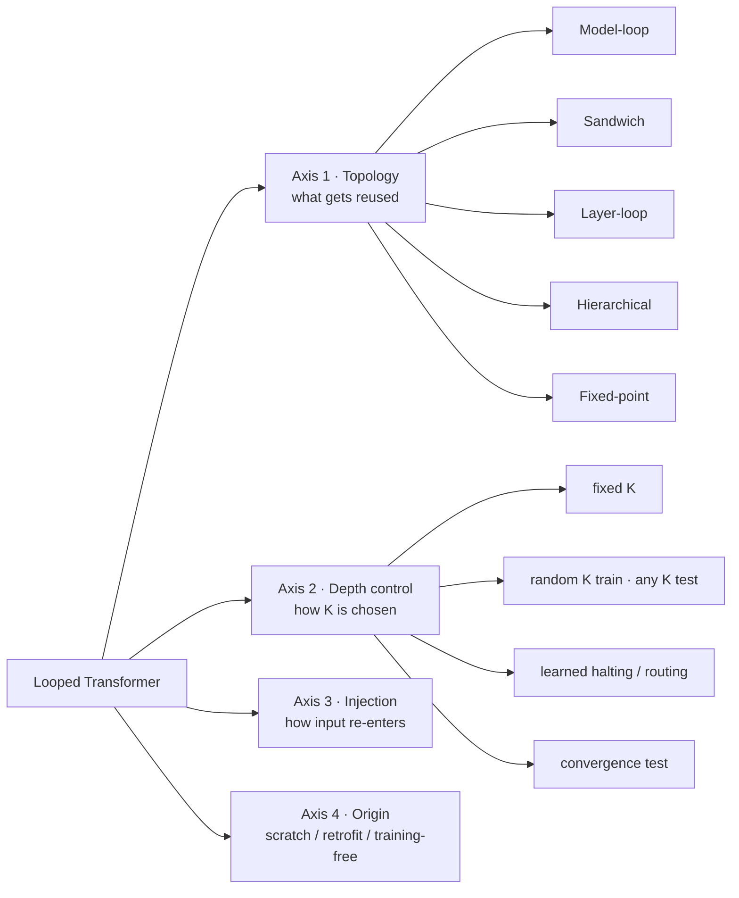
```mermaid
flowchart LR
    A[Looped Transformer] --> T[Axis 1 · Topology<br/>what gets reused]
    A --> D[Axis 2 · Depth control<br/>how K is chosen]
    A --> I[Axis 3 · Injection<br/>how input re-enters]
    A --> O[Axis 4 · Origin<br/>scratch / retrofit / training-free]
    T --> T1[Model-loop]
    T --> T2[Sandwich]
    T --> T3[Layer-loop]
    T --> T4[Hierarchical]
    T --> T5[Fixed-point]
    D --> D1[fixed K]
    D --> D2[random K train · any K test]
    D --> D3[learned halting / routing]
    D --> D4[convergence test]
```

Notation: $e = \mathrm{emb}(x)$ is the token embedding, $s_k$ the residual state after loop $k$, $R$ the shared block, $K$ the number of loops.

---

## Axis 1 — Loop topology (the five "types")

### Type 1 · Model-loop (flat, whole-stack)

The entire layer stack $\mathcal{M}^L$ is applied $K$ times: $F^{(K)} = \mathrm{lmhead}\circ(\mathcal{M}^L)^{\circ K}\circ\mathrm{emb}$. Every layer is shared across loops; $K=1$ recovers the ordinary transformer.

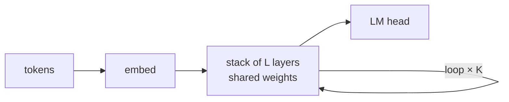
```mermaid
flowchart LR
    x[tokens] --> E[embed]
    E --> S[stack of L layers<br/>shared weights]
    S -->|"loop × K"| S
    S --> H[LM head]
```

**Universal Transformer** (Dehghani et al., 2018) is the origin: one attention + transition block applied for $T$ steps to every position in parallel, with a timestep embedding added at each step and, optionally, ACT halting per position.

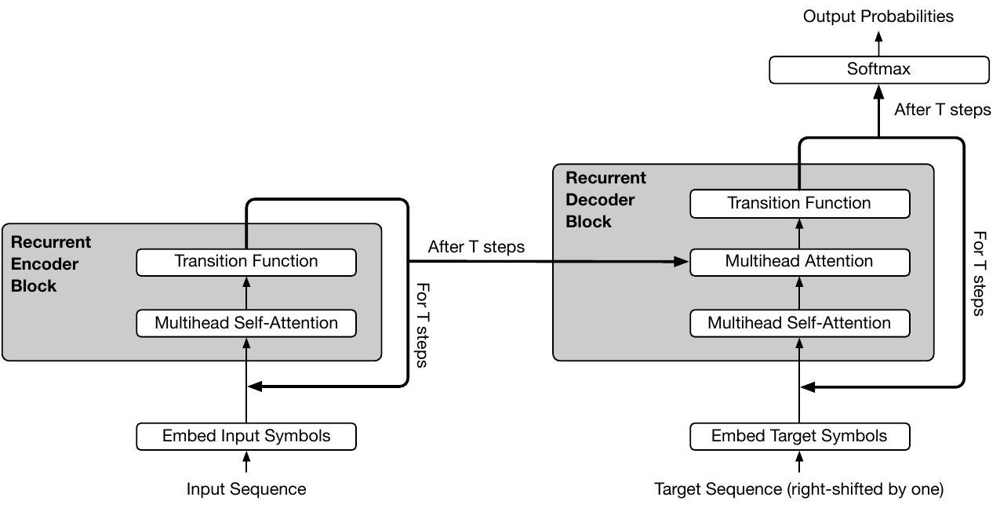

**Ouro** (Zhu et al., 2025) is the industrial-scale version: 1.4B and 2.6B models, the full stack looped $T_{\max}=4$ times, an LM head read out *after every loop* (cross-entropy at each step) plus an entropy-regularised learned exit gate, pretrained on 7.7T tokens. The 2.6B model matches dense models up to 12B on reasoning-heavy benchmarks.

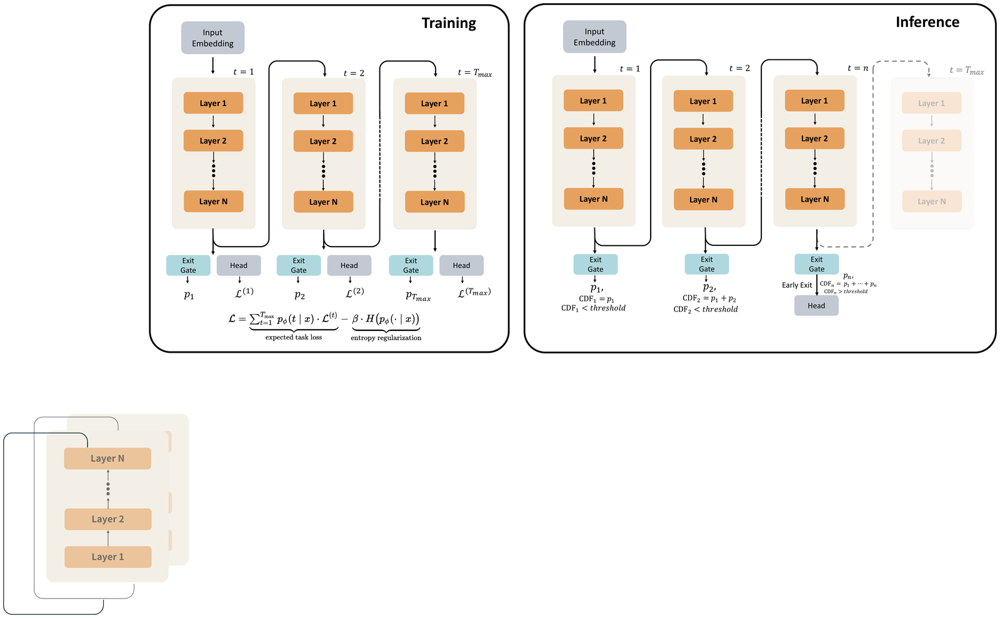

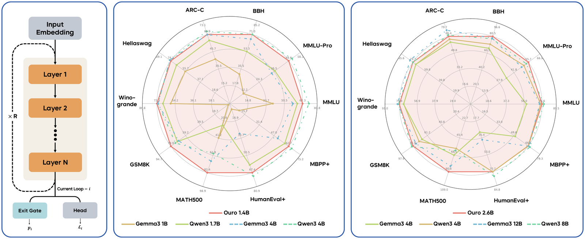

**Nanbeige4.2-3B** (Nanbeige Lab, 2026) is the same idea shipped as a production agentic model: "reuses the same Transformer stack to process hidden states for an additional pass" (i.e. $K=2$), 3B non-embedding parameters, 28T tokens from scratch. It is the model Sebastian Raschka used to explain the reported OpenAI Astra architecture.

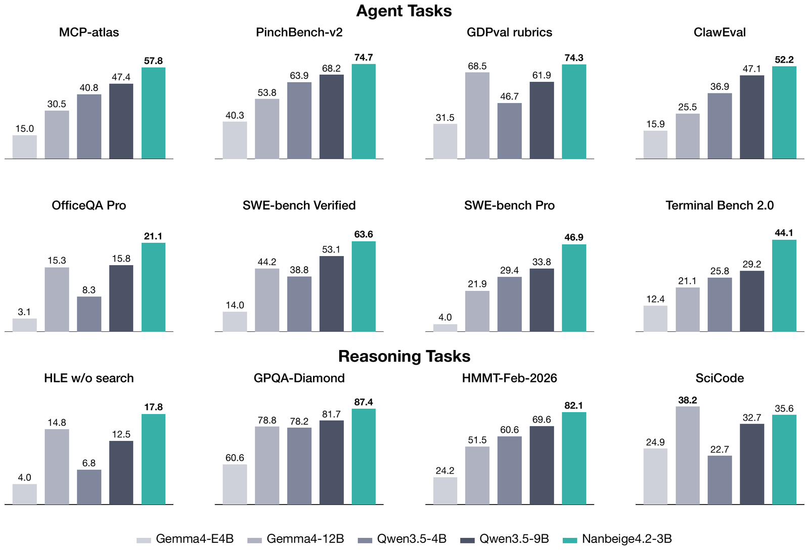

*Pros*: simplest to implement; all parameters get $K\times$ the gradient signal. *Cons*: the embedding/readout layers are forced to be reusable middle layers too, and KV cache grows $K\times$ unless shared (see PLT below).

---

### Type 2 · Sandwich (prelude → core × K → coda)

Untied *prelude* layers $P$ embed into latent space, a shared *core* block $R$ is iterated, untied *coda* layers $C$ decode. Only the middle recurs.

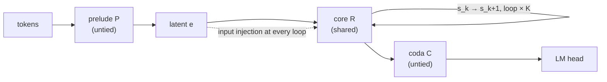
```mermaid
flowchart LR
    x[tokens] --> P["prelude P<br/>(untied)"]
    P --> e[latent e]
    e --> R["core R<br/>(shared)"]
    R -->|"s_k → s_k+1, loop × K"| R
    e -.->|input injection at every loop| R
    R --> C["coda C<br/>(untied)"] --> H[LM head]
```

**Huginn** (Geiping et al., 2025) is the reference design. Prelude 2 layers, core 4 layers, coda 2 layers; $s_0\sim\mathcal N(0,\sigma^2 I)$; the embedding $e$ is injected into the core at every iteration; at train time the loop count $r$ is sampled from a log-normal Poisson with mean 32 and gradients are truncated to the last 8 iterations; 3.5B parameters, 800B tokens. At test time you simply unroll further.

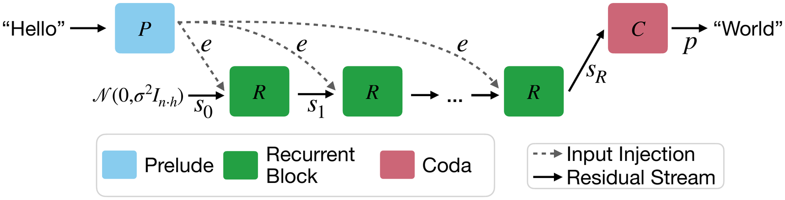

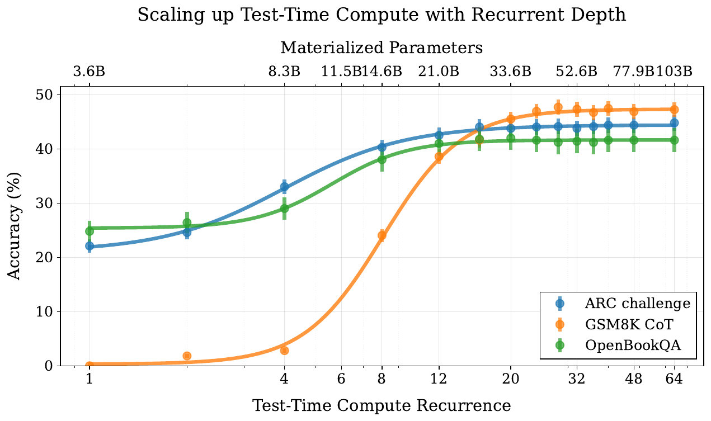

**Hyperloop Transformer** (Zeitoun, Torroba-Hennigen, Kim, 2026) keeps the begin/middle/end split and widens the residual stream into *matrix-valued* streams via hyper-connections applied once per loop, matching depth-matched baselines with ~50% fewer parameters.

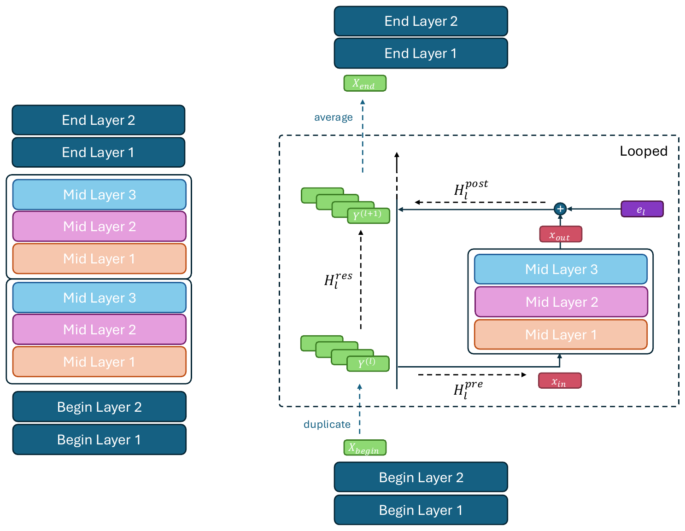

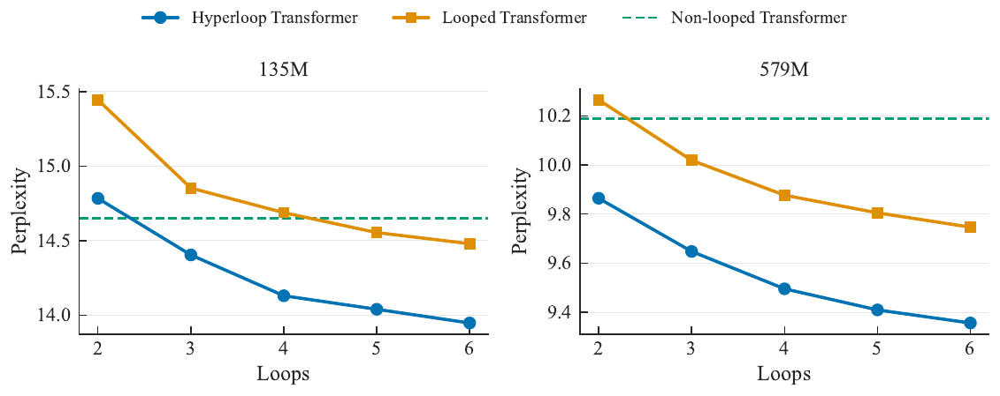

**SMELT** (Wang et al., 2026) is the sandwich taken to MoE scale under strict budget matching: loop the middle 50% of layers twice, narrow the hidden size and add experts to hold parameters constant, scale looped residuals by 1/2, shrink head size at a higher GQA ratio so the KV cache barely grows. Result: 6.8–18% training-FLOP savings on the compute-optimal frontier, largest on code.

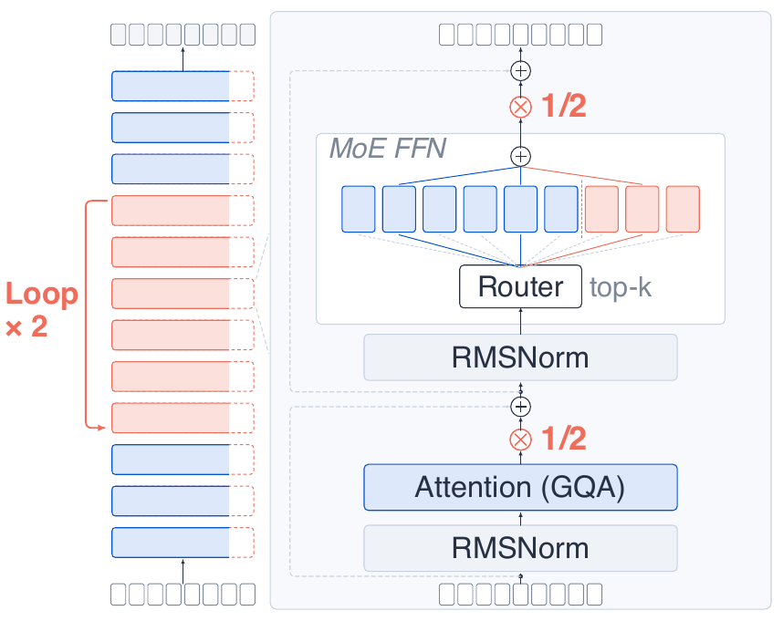

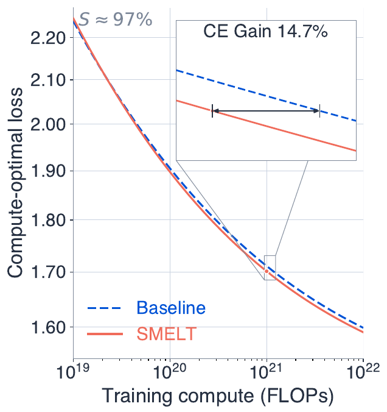

*Pros*: embedding and readout get dedicated capacity; the core's job is purely "refine the state". *Cons*: an extra design space (how deep is the prelude/coda, how to inject) that Parcae shows is where instability comes from.

---

### Type 3 · Layer-loop (per-layer recurrence)

Instead of traversing the whole stack and repeating, **each layer is applied $K$ times before its output is passed to the next layer**.

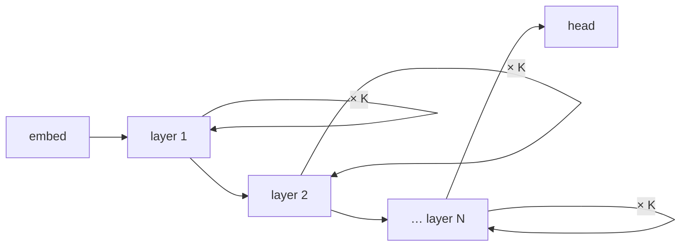
```mermaid
flowchart LR
    x[embed] --> L1["layer 1"]
    L1 -->|"× K"| L1
    L1 --> L2["layer 2"]
    L2 -->|"× K"| L2
    L2 --> Ln["… layer N"]
    Ln -->|"× K"| Ln
    Ln --> H[head]
```

**Loopie** (Gao et al., 2026) introduced the name and the contrast with model-loop. Loopie-20B-A2B and 6B-A0.6B are MoE models with $K=2$ per layer, trained with a *compute-matched* recipe: the claim is not parameter efficiency but that, under equal pre-training FLOPs, looping beats spending the compute on more stored layers. Layer-loop lags model-loop early in training and overtakes it later; Loopie-20B-A2B passes a reproduced Qwen3-30B-A3B after ~600B tokens.

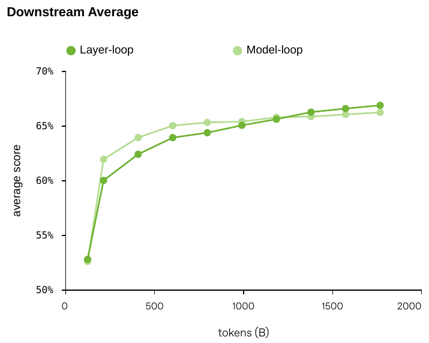

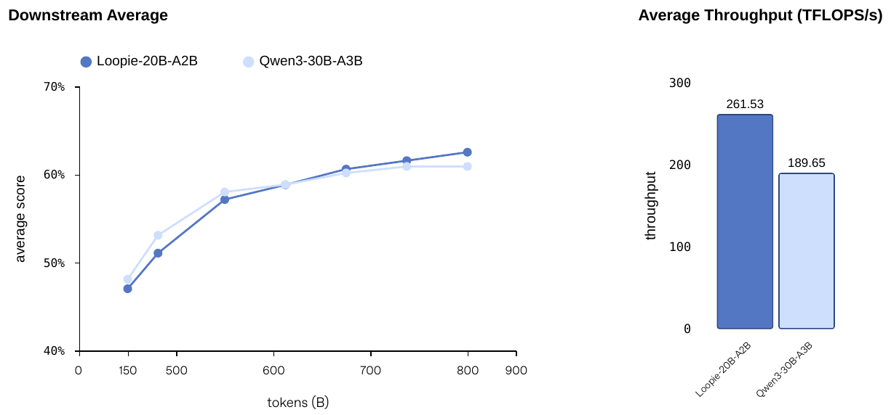

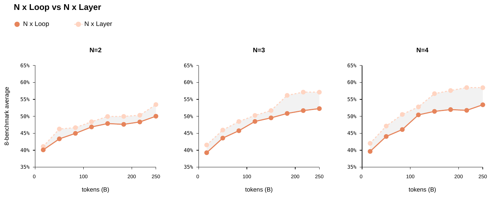

**MixerLoop** (Lin et al., 2026) asks *what inside a layer* should loop: it repeats only the Gated DeltaNet token mixer and runs the dense FFN once, arguing via "iterative transport rank" that a loop is worth doing only when it exposes a new cross-position influence direction.

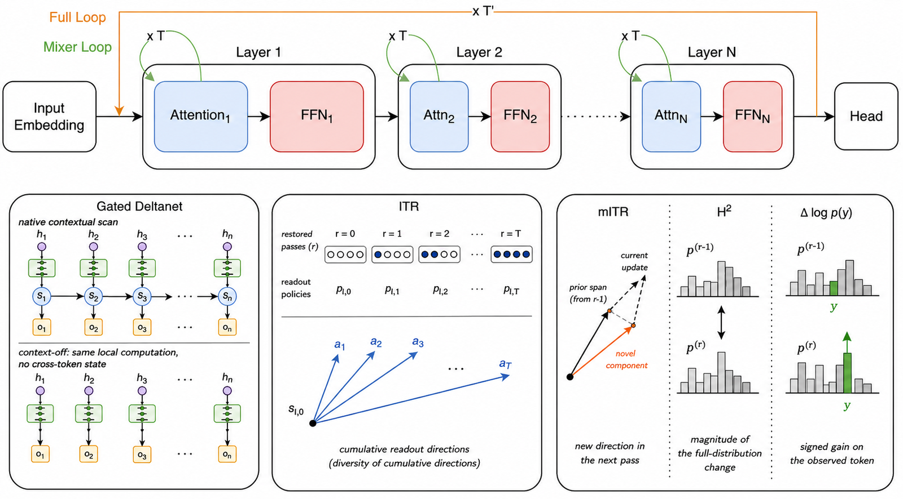

*Pros*: activation memory stays that of a single layer; works well with MoE because each layer's router can send the second pass to different experts. *Cons*: less "global refinement" per loop than model-loop; the two schedules have not yet been compared at Ouro scale under one recipe.

---

### Type 4 · Hierarchical / two-timescale

Two coupled recurrent modules run at different rates: a slow high-level state $z_H$ updated once per cycle, a fast low-level state $z_L$ updated $T$ times per cycle, with the whole thing wrapped in deep supervision (the answer is re-predicted and the states carried over, detached, for $N_{\text{sup}}$ outer steps).

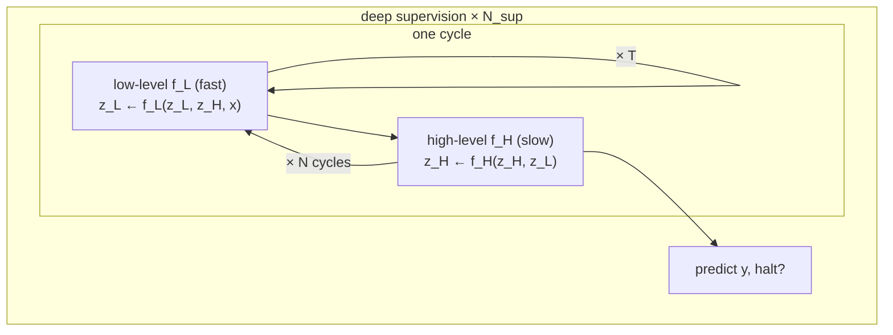
```mermaid
flowchart TB
    subgraph outer["deep supervision × N_sup"]
        subgraph cycle["one cycle"]
            L["low-level f_L (fast)<br/>z_L ← f_L(z_L, z_H, x)"] -->|"× T"| L
            L --> Hm["high-level f_H (slow)<br/>z_H ← f_H(z_H, z_L)"]
        end
        Hm -->|"× N cycles"| L
        Hm --> out[predict y, halt?]
    end
```

**HRM** (Wang et al., 2025): 27M parameters, two 4-layer transformer modules, a one-step gradient approximation instead of BPTT, ACT-style halting learned with a Q-head, trained on ~1000 examples per task; near-perfect Sudoku-Extreme and Maze, strong ARC-AGI. The H-module converges steadily while the L-module repeatedly converges and is "reset" by the new $z_H$ (hierarchical convergence).

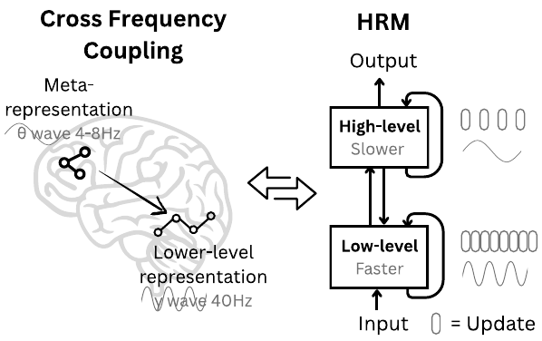

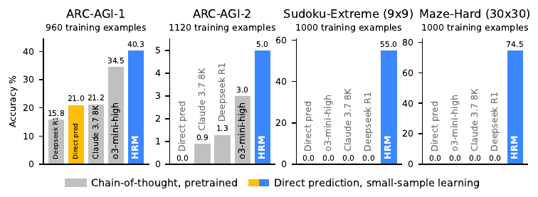

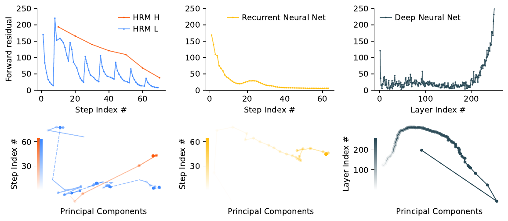

**TRM** (Jolicoeur-Martineau, 2025) strips HRM down to **one** 2-layer network and two variables: $n$ steps of "update latent $z$ given $(x,y,z)$", then one step of "update answer $y$ given $(y,z)$", repeated with $N_{\text{sup}}=16$ deep-supervision steps. 7M parameters, 45% ARC-AGI-1, 8% ARC-AGI-2. The takeaway (also found by the ARC Prize team's ablation): deep supervision and recursion matter; the biological hierarchy story mostly does not.

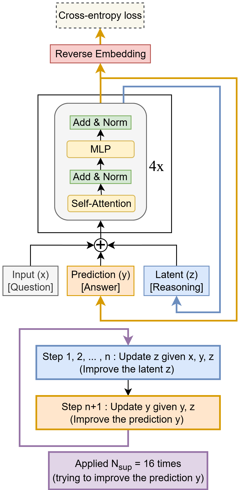

*Pros*: extreme parameter efficiency on puzzle-style reasoning; state carried across supervision steps acts like an outer refinement loop. *Cons*: results are on small supervised puzzle benchmarks with heavy augmentation; "Tiny Autoregressive Recursive Models" finds no consistent benefit when ported to autoregressive language tasks.

---

### Type 5 · Fixed-point / implicit (K → ∞)

Instead of choosing $K$, solve for the equilibrium $s^\star = R(s^\star, e)$ directly and backpropagate through it with the implicit function theorem. Depth becomes "until converged".

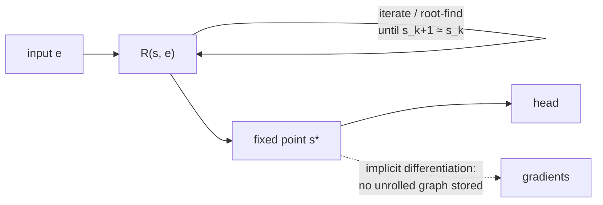
```mermaid
flowchart LR
    e[input e] --> R["R(s, e)"]
    R -->|"iterate / root-find<br/>until s_k+1 ≈ s_k"| R
    R --> S["fixed point s*"] --> H[head]
    S -.->|"implicit differentiation:<br/>no unrolled graph stored"| G[gradients]
```

**Deep Equilibrium Models** (Bai, Kolter, Koltun, 2019): weight-tied transformer whose hidden layers were observed to converge anyway, so find $s^\star$ by Broyden's method and train with constant memory regardless of effective depth; up to 88% memory reduction on WikiText-103 at equal perplexity.

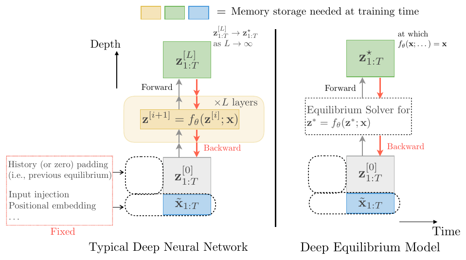

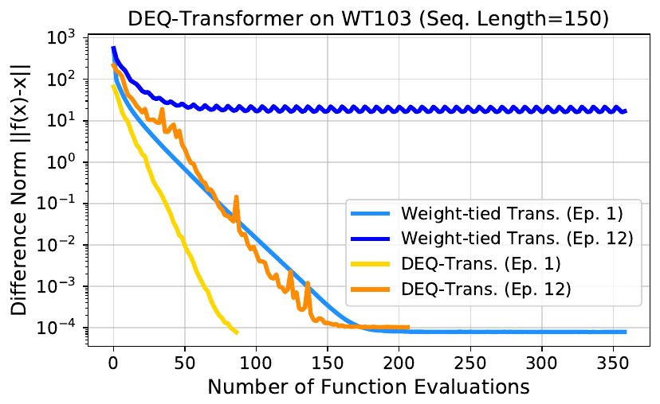

**Fixed-Point Reasoners (FPRM)** (Movahedi et al., 2026) bring this to the modern looped-reasoner setting: pre-norm plus residual scaling fix signal propagation at depth, and **fixed-point convergence is the halting rule**, so compute adapts to instance difficulty. On Sudoku-Extreme FPRM beats TRM by ~10 accuracy points while stopping ~27% earlier on hard puzzles.

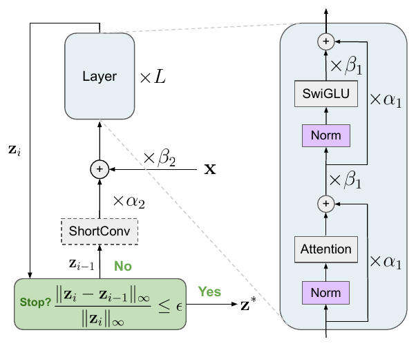

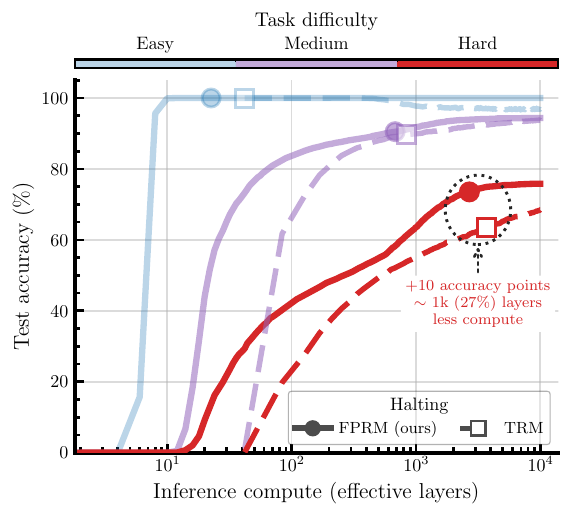

*Pros*: constant memory, principled halting, clean theory (contractive maps). *Cons*: needs the recurrent map to be (near-)contractive, which the language-model results in Type 2 show is not automatic; root-finding at scale is expensive.

---

## Axis 2 — Depth control (how many loops?)

| Control | Mechanism | Examples |
|---|---|---|
| Fixed $K$ | same at train and test | Ouro (4), Nanbeige (2), Loopie (2), SMELT (2) |
| Random $K$ at train, any $K$ at test | sample $K\sim$ log-normal Poisson; truncated BPTT | Huginn, Parcae, LoopFormer |
| Learned halting or routing | ACT ponder cost; exit gate; per-token router | Universal Transformer, Ouro's exit gate, **Mixture-of-Recursions** |
| Convergence test | stop when $\|s_{k+1}-s_k\|$ small | DEQ, FPRM, Huginn's zero-shot KL exit |

**Mixture-of-Recursions** (Bae et al., 2025) is the reference for per-token depth. A shared stack is the "recursion block"; a lightweight router decides each token's recursion depth. *Expert-choice*: at recursion $r$ the router scores the tokens still active and keeps the top-$k$ (hierarchical filtering, so a token cannot re-enter once dropped). *Token-choice*: the token picks its depth up front. Attention and KV cache are restricted to tokens still active at that depth (recursion-wise caching), or the first recursion's KV is shared with the rest.

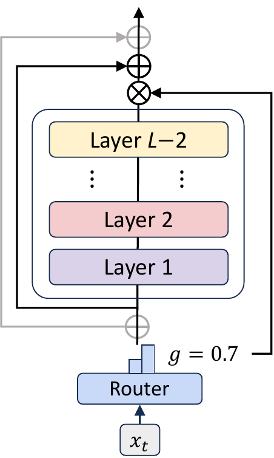

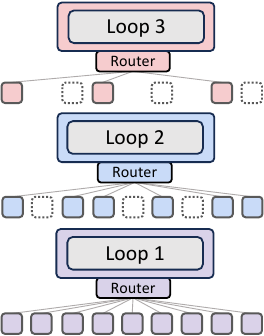

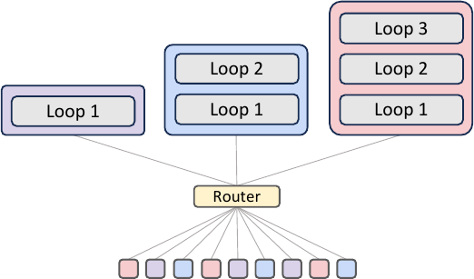

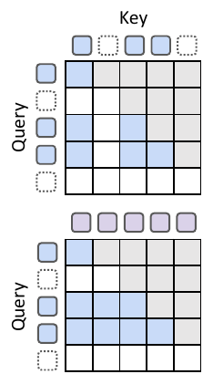

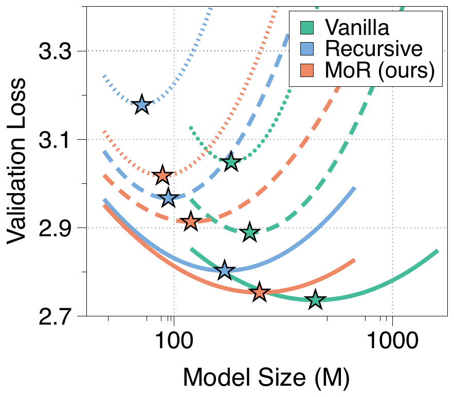

For the *random-K* family, Huginn's training distribution is the standard choice: a log-normal Poisson centred on $\bar r$ with a heavy right tail so the model occasionally sees very deep unrolls.

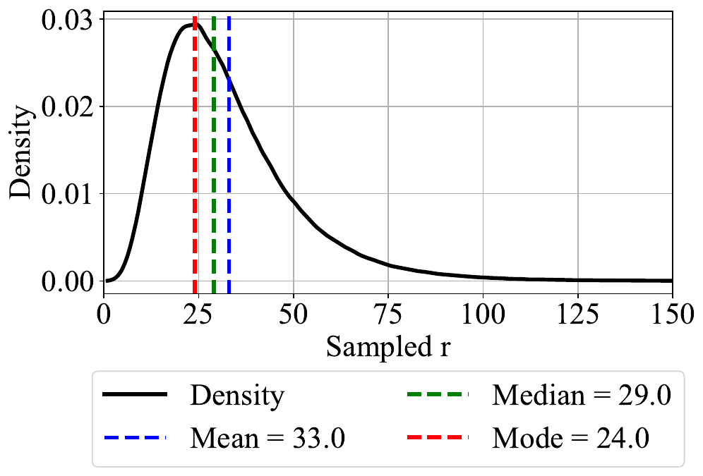

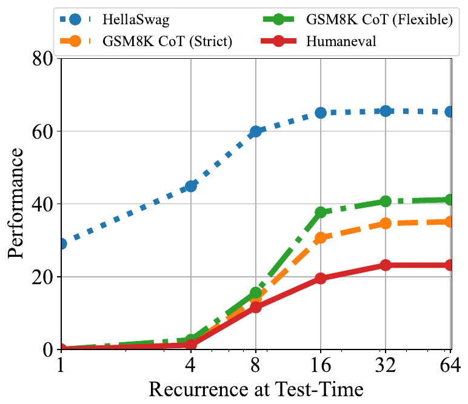

A recurring finding: running past the trained depth helps only if the recurrent map is stable. Ouro trained at 4 loops got *worse* at 8; Parcae's test-time curve saturates as a predictable exponential rather than diverging.

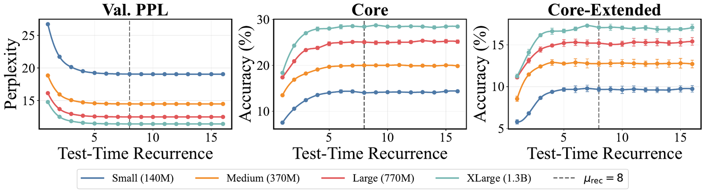

---

## Axis 3 — Input injection and stability

How the original embedding $e$ re-enters the loop decides whether deep unrolls diverge.

| Injection | Description | Examples |
|---|---|---|
| None | pure recurrence on the state | Ouro, Nanbeige, Loopie |
| Additive / concat | $s_{k+1} = R(A s_k + B e)$ or $R([s_k; e])$ | Huginn (concat), Looped ICL transformers, DiscoLoop (dual channel) |
| Constrained / normalised | spectral-norm-bounded $A$, normalised $e$, hyper-connections | **Parcae**, Fully Looped Transformer, Hyperloop |

**Parcae** (Prairie et al., 2026) recasts looping as a time-variant dynamical system over the residual stream $h_{t+1} = \mathcal R(\mathbf A h_t + \mathbf B e)$, shows via a linear approximation that residual explosion in prior looped LMs comes from large spectral norms of the injection parameters, and constrains them through a discretised negative-diagonal parameterisation. With the loop stable it fits isoFLOP scaling laws over (mean recurrence, data) and scales to 1.3B.

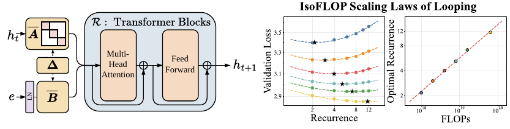

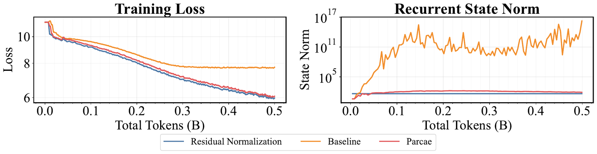

Related stability recipes in the repo: residual scaling in loop count (*On the Residual Scaling of Looped Transformers*, DeepLoop), Jacobian spectral-radius regularisation (STARS), pre-norm + residual scaling (FPRM), and the parameter-free attention-injection of the *Fully Looped Transformer*.

---

## Axis 3½ — Serving the loop: Parallel Loop Transformer

Looping multiplies decode latency by $K$ unless the loops are overlapped. **PLT** (Wu et al., 2025) computes loop $k$ of token $t$ in the same forward pass as loop $k-1$ of token $t+1$ (cross-loop parallelism), shares the first loop's KV cache with all later loops, and adds gated sliding-window attention so later loops still see fresh local context. Result: looped-model accuracy at close to single-pass latency and memory.

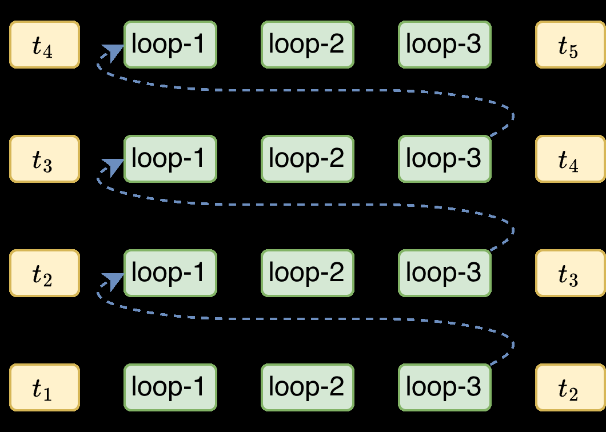

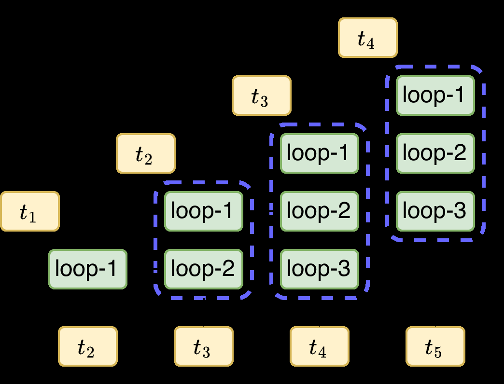

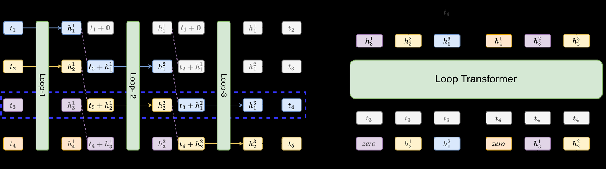

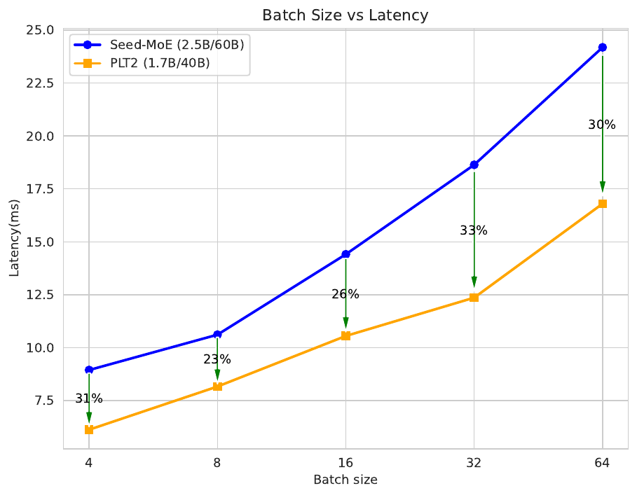

---

## Axis 4 — Origin

- **From scratch**: everything above except the retrofits.
- **Retrofit a pretrained LLM**: Relaxed Recursive Transformers (block + per-depth LoRA), Encode-Think-Decode (iterate a chosen set of middle layers), Retrofitted Recurrence (Huginn recipe applied to Qwen/Llama), LoopUS, MELT. Cheap, and the only route if you cannot pretrain.
- **Training-free**: Training-Free Looped Transformers, CoLa / Program-of-Layers, Recirculation re-apply existing *untied* layers at inference. Strictly a different object (no weight tying), listed in the README with a strictness note.

---

## Cheat sheet

| Paper | Topology | K (train → test) | Depth control | Injection | Scale | Origin |
|---|---|---|---|---|---|---|
| Universal Transformer (2018) | model-loop | T fixed or ACT | ACT per position | timestep embed | small | scratch |
| DEQ (2019) | fixed-point | ∞ | convergence | input in $f(z,x)$ | WikiText-103 | scratch |
| Huginn (2025) | sandwich 2/4/2 | ~32 random → any | KL-based zero-shot exit | concat $e$ each loop | 3.5B, 800B tok | scratch |
| HRM (2025) | hierarchical | N cycles × T steps | ACT Q-head | $x$ into $f_L$ | 27M | scratch |
| MoR (2025) | flat, shared stack | ≤ $N_r$ per token | router (expert/token-choice) | none | 135M–1.7B | scratch |
| TRM (2025) | hierarchical (1 net) | n × N_sup=16 | fixed | $x$ each step | 7M | scratch |
| Ouro (2025) | model-loop | 4 → 4 | entropy-regularised exit | none | 1.4B/2.6B, 7.7T tok | scratch |
| PLT (2025) | model-loop, cross-token parallel | fixed | fixed | none; shared KV | ≤ 2.5B/60B MoE | scratch |
| Parcae (2026) | sandwich | μ=8 random → any | fixed / saturating | spectrally bounded | ≤ 1.3B | scratch |
| Hyperloop (2026) | sandwich + hyper-connections | 2–6 | fixed | hyper-connections | 135M–579M | scratch |
| FPRM (2026) | fixed-point | until converged | convergence | pre-norm, residual scaling | small | scratch |
| Loopie (2026) | layer-loop | 2 → 2 | fixed | none | 20B-A2B MoE, 3.5T tok | scratch |
| Nanbeige4.2 (2026) | model-loop | 2 → 2 | fixed | none | 3B, 28T tok | scratch |
| MixerLoop (2026) | layer-loop (mixer only) | T | fixed | none | 15M–110M | scratch |
| SMELT (2026) | sandwich (middle 50%) | 2 → 2 | fixed | ½ residual scaling | ≤ 54B MoE | scratch |

---

## References

1. Dehghani, Gouws, Vinyals, Uszkoreit, Kaiser. **Universal Transformers.** ICLR 2019. [arXiv:1807.03819](https://arxiv.org/abs/1807.03819)
2. Bai, Kolter, Koltun. **Deep Equilibrium Models.** NeurIPS 2019. [arXiv:1909.01377](https://arxiv.org/abs/1909.01377)
3. Geiping, McLeish, Jain, Kirchenbauer, Singh, Bartoldson, Kailkhura, Bhatele, Goldstein. **Scaling up Test-Time Compute with Latent Reasoning: A Recurrent Depth Approach.** NeurIPS 2025. [arXiv:2502.05171](https://arxiv.org/abs/2502.05171) · [code](https://github.com/seal-rg/recurrent-pretraining)
4. Wang, Li, Sun, Chen, Liu, Wu, Lu, Song, Abbasi Yadkori. **Hierarchical Reasoning Model.** 2025. [arXiv:2506.21734](https://arxiv.org/abs/2506.21734) · [code](https://github.com/sapientinc/HRM)
5. Bae, Kim, Bayat, Kim, Ha, Schuster, Fisch, Harutyunyan, Ji, Courville, Yun. **Mixture-of-Recursions: Learning Dynamic Recursive Depths for Adaptive Token-Level Computation.** NeurIPS 2025. [arXiv:2507.10524](https://arxiv.org/abs/2507.10524) · [code](https://github.com/raymin0223/mixture_of_recursions)
6. Jolicoeur-Martineau. **Less is More: Recursive Reasoning with Tiny Networks.** 2025. [arXiv:2510.04871](https://arxiv.org/abs/2510.04871) · [code](https://github.com/SamsungSAILMontreal/TinyRecursiveModels)
7. Wu, Chen, Luo, Yan, Yu, Xu, Bin, et al. **Parallel Loop Transformer for Efficient Test-Time Computation Scaling.** 2025. [arXiv:2510.24824](https://arxiv.org/abs/2510.24824)
8. Zhu, Wang, Hua, Zhang, Li, et al. **Scaling Latent Reasoning via Looped Language Models.** 2025. [arXiv:2510.25741](https://arxiv.org/abs/2510.25741) · [project](https://ouro-llm.github.io/)
9. Prairie, Novack, Berg-Kirkpatrick, Fu. **Parcae: Scaling Laws For Stable Looped Language Models.** LIT Workshop @ ICLR 2026. [arXiv:2604.12946](https://arxiv.org/abs/2604.12946)
10. Zeitoun, Torroba-Hennigen, Kim. **Hyperloop Transformers.** COLM 2026. [arXiv:2604.21254](https://arxiv.org/abs/2604.21254)
11. Movahedi, Milovanović, Feigin, et al. **Fixed-Point Reasoners: Stable and Adaptive Deep Looped Transformers.** 2026. [arXiv:2606.18206](https://arxiv.org/abs/2606.18206) · [code](https://github.com/nilskiKonjIzDunava/fprm)
12. Gao, Chen, Xiao, Yang, Tao, Zhou, Dai. **Loop the Loopies!** 2026. [arXiv:2607.16051](https://arxiv.org/abs/2607.16051)
13. Nanbeige Lab. **Nanbeige4.2-3B: Unlocking Agentic Capabilities in a Compact Model.** 2026. [arXiv:2607.22083](https://arxiv.org/abs/2607.22083) · [HF](https://huggingface.co/Nanbeige/Nanbeige4.2-3B)
14. Lin, Guo, Zhu, Ye, Eshraghian. **Allocating Recurrent Compute in Looped Language Models.** 2026. [arXiv:2608.18230](https://arxiv.org/abs/2608.18230)
15. Wang, Zhang, Luo, Wu, Liu, et al. **SMELT: Scaling Laws for Compute-Matched MoE Looped Transformers.** 2026. [arXiv:2609.01343](https://arxiv.org/abs/2609.01343)

Further reading on each axis (theory, mechanistic analysis, retrofits, serving) is indexed in the repo [README](../README.md). BibTeX: [`references.bib`](references.bib).
