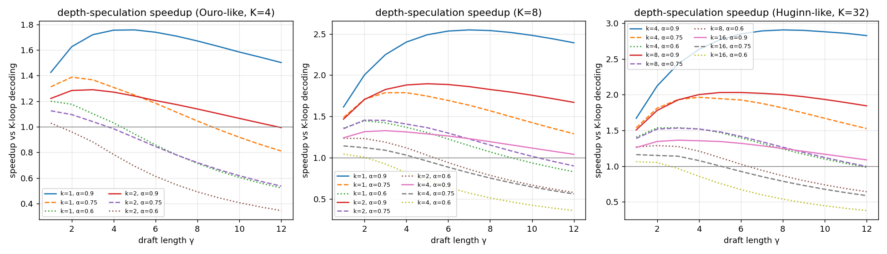

# Speculative Decoding for Looped Transformers — survey and research proposal

> **Status:** research notes, 2026-09-05. Part 1 surveys speculative decoding (SD) for ordinary transformers. Part 2 lists what a looped model changes and what has already been said about SD for looped models. Part 3 brainstorms and ranks new ideas; Part 4 refines the top three into proposals with a cost model, experiments, and the strongest objections. Companion to the [taxonomy note](looped-transformer-taxonomy.md).

---

## 1. Speculative decoding for standard transformers: the families

All methods share one structure: a cheap **drafter** proposes tokens, the **target** scores them in one parallel pass, and a rejection rule (Leviathan et al. 2022; Chen et al. 2023) keeps the output distribution exactly that of the target. Speedup ≈ (expected accepted tokens + 1) × (target pass time) / (draft time + verify time). Families differ in *where the drafter comes from* and *what is verified*.

| Family | What drafts | Where the leverage comes from | Representative papers | Typical speedup |
|---|---|---|---|---|
| **A. Separate draft model** | a smaller LM of the same family | 5–10× fewer params ⇒ draft passes are almost free; memory-bound decode makes the parallel verify pass cost ≈ one token | Leviathan et al. [2211.17192](https://arxiv.org/abs/2211.17192); Chen et al. [2302.01318](https://arxiv.org/abs/2302.01318); SpecInfer tree verification [2305.09781](https://arxiv.org/abs/2305.09781); Sequoia [2402.12374](https://arxiv.org/abs/2402.12374) | 1.5–2.5× |
| **B. Heads on the target's hidden state** | lightweight heads read the target's last hidden state and predict tokens t+1…t+n | no second model; drafts for several positions from one target pass; tree attention verifies candidates jointly | Medusa [2401.10774](https://arxiv.org/abs/2401.10774); Hydra (sequentially dependent heads) [2402.05109](https://arxiv.org/abs/2402.05109); MTP heads baked into pretraining (DeepSeek-V3 [2412.19437](https://arxiv.org/abs/2412.19437)) | 2–3.6× |
| **C. Feature-level autoregressive drafter** | a 1-layer drafter autoregresses on the target's *features* (second-to-top layer) rather than tokens | features are smoother than tokens; EAGLE-2 adds context-aware dynamic trees; EAGLE-3 fuses multi-layer features and predicts tokens directly, so it scales with data | EAGLE [2401.15077](https://arxiv.org/abs/2401.15077); EAGLE-2 [2406.16858](https://arxiv.org/abs/2406.16858); EAGLE-3 [2503.01840](https://arxiv.org/abs/2503.01840); HASS [2408.15766](https://arxiv.org/abs/2408.15766); Falcon (semi-AR) [2412.12639](https://arxiv.org/abs/2412.12639); Beagle cross-attention [2505.24544](https://arxiv.org/abs/2505.24544) | 3–6.5× |
| **D. Block / diffusion drafters** | a block-diffusion drafter emits a whole block in one pass, conditioned on target hidden states | one draft pass per block instead of per token; DFlare / TreeFlash / xPress fix the independence of per-position marginals | DFlash [2602.06036](https://arxiv.org/abs/2602.06036); block-diffusion draft trees [2604.12989](https://arxiv.org/abs/2604.12989); DFlare [2606.02091](https://arxiv.org/abs/2606.02091); TreeFlash [2606.03819](https://arxiv.org/abs/2606.03819); xPress [2608.02438](https://arxiv.org/abs/2608.02438) | up to 6×+ |
| **E. Self-speculation by layer skipping / early exit** | the *same* model with layers skipped or an early exit | zero extra parameters; draft and verify share the prefix of the compute and the KV cache | Draft & Verify [2309.08168](https://arxiv.org/abs/2309.08168); LayerSkip (layer-dropout + shared exit head at train time) [2404.16710](https://arxiv.org/abs/2404.16710); Kangaroo (shallow subnet + adapter, double early exit) [2404.18911](https://arxiv.org/abs/2404.18911); SWIFT / CLaSp / ConfLayers / KnapSpec (dynamic skip schedules) [2410.06916](https://arxiv.org/abs/2410.06916) · [2604.14612](https://arxiv.org/abs/2604.14612) · [2602.20217](https://arxiv.org/abs/2602.20217); PPSD pipelines draft and verify across layers [2509.19368](https://arxiv.org/abs/2509.19368); component-aware SSD uses the SSM sub-graph of a hybrid model as the drafter [2605.01106](https://arxiv.org/abs/2605.01106) | 1.3–2.2× (PPSD up to 3.8×) |
| **F. Jacobi / consistency parallel decoding** | the target itself, iterated on a guessed n-gram until the fixed point | reformulates AR decoding as a fixed-point equation; CLLM fine-tunes the model to jump to the fixed point in one step | Lookahead [2402.02057](https://arxiv.org/abs/2402.02057); CLLMs [2403.00835](https://arxiv.org/abs/2403.00835) | 1.5–3.4× |
| **G. Retrieval / n-gram drafters** | matches in the prompt or a datastore | free drafts for repetitive text | PLD; REST [2311.08252](https://arxiv.org/abs/2311.08252); SuffixDecoding [2411.04975](https://arxiv.org/abs/2411.04975) | task-dependent |
| **H. Control & training of the loop** | — | choose draft length / drafter online; train drafters for *sequence acceptance* rather than token likelihood | Learning to Draft (RL) [2603.01639](https://arxiv.org/abs/2603.01639); Variational SD [2602.05774](https://arxiv.org/abs/2602.05774); Not-a-Bandit drafter selection [2510.20064](https://arxiv.org/abs/2510.20064) | +10–30% on top |

Two lessons carry over to looped models:

1. **The drafter's cost fraction is the whole game.** Family A works because the drafter is ~10% of the target. Family E's repeated finding (LayerSkip, PPSD) is that skipping half the layers gives a drafter that is *half* the cost, so it only pays off at very high acceptance, and PPSD had to hide the draft cost by pipelining it under verification.
2. **The best drafters read the target's internals.** EAGLE/DFlash condition on target hidden states; Medusa/MTP heads sit on them. Whatever the drafter is, giving it the target's representation is worth more than giving it more parameters.

---

## 2. What a looped transformer changes

A looped model $F^{(K)} = C\circ R^{\circ K}\circ P$ (prelude $P$, shared core $R$ iterated $K$ times, coda $C$; see the [taxonomy note](looped-transformer-taxonomy.md)) has five properties no standard transformer has:

| Property | Why it matters for SD |
|---|---|
| **P1. Every intermediate loop state $s_k$ is a legitimate model output.** Huginn is trained with random $K$; Ouro puts an LM head and a cross-entropy loss on *every* loop. | The model at depth $k<K$ is a valid drafter *for free*: no LayerSkip-style training, no adapter (Kangaroo), no separate weights. This is the point Huginn makes in §"Zero-Shot Self-Speculative Decoding". |
| **P2. Draft and target share the residual stream.** The $k$-loop draft state is literally the first $k$ loops of the $K$-loop verification. | Verification can *resume* from the draft's state and run only $K-k$ more loops — the draft compute is never wasted (Huginn notes this too). Layer-skipping self-speculation cannot do this because skipped layers still have to run. |
| **P3. Depth is a per-token dial with a built-in confidence signal.** Successive-loop KL (Huginn), the learned exit gate (Ouro), the router (MoR), or the fixed-point residual (FPRM) tell you how "done" a token is. | Draft depth, draft length and even *verification depth* can be chosen per token from the model's own convergence signal. |
| **P4. Loops form a fixed-point trajectory.** Updates shrink and become orthogonal (Two-Scale Latent Dynamics); many tokens converge in a few loops (Huginn Fig. 11). | The trajectory is extrapolable: the same trick CLLM plays along the sequence (jump to the fixed point) can be played along depth. |
| **P5. Loops can be overlapped across positions.** PLT runs loop $k$ of token $t$ with loop $k-1$ of token $t+1$; Geiping et al.'s diffusion-forcing sampler advances a "diagonal wavefront" of positions × loops. | The 2-D (position × depth) schedule is a natural place to insert speculation: cells ahead of the wavefront are drafts. |

### 2.1 What has already been said or done

| Work | What it does | Gap |
|---|---|---|
| Huginn (Geiping et al. 2025, §Zero-Shot Self-Speculative Decoding) | Two paragraphs: draft with $N$ iterations, verify with $M>N$, optionally staged or with adaptive draft compute; drafting states are reused. | Not implemented or measured. No acceptance-rate or speedup numbers. |
| Efficient Parallel Samplers for Recurrent-Depth Models (Geiping et al., [2510.14961](https://arxiv.org/abs/2510.14961)) | Diffusion-forcing sampler: every forward pass emits a new token draft *and* refines the latent states of all unfinished positions; positions are frozen when their state converges; up to **5×** speedup on Huginn with no tuning. Argues depth should scale in prefill and width in decode. | **Not lossless.** A position is refined while its left context is still made of drafts, so the final output is a different sampler, not $F^{(K)}$. Also no FLOP reduction. |
| MoR (Bae et al. 2025, §3.2) | Notes that per-token early exit leaves missing KV pairs at deeper recursions and that fixing this "would require a parallel decoding mechanism" like early-exit SD. | Names the problem, does not solve it. |
| Ouro (Zhu et al. 2025) | Learned exit gate with a threshold $q$; per-loop LM heads. | Uses the gate for adaptive compute, not as a drafting/acceptance signal. |
| PLT (Wu et al. 2025) | Cross-loop parallelism plus shared first-loop KV and gated sliding-window attention; near single-pass latency for a looped model. | An architecture change (must be trained that way). No speculation. |
| LayerSkip / Kangaroo / PPSD (Family E) | Early-exit self-speculation on *untied* stacks. | The drafter is a different sub-network; states cannot be resumed; extra training or adapters needed. |
| CLLM (Family F) | Consistency training along the *sequence* fixed point. | Never applied along the *depth* fixed point. |

So: depth-speculation is a known *remark*, the parallel sampler is a known *lossy* method, and nobody has built the lossless, measured, KV-aware version or combined depth with the strong drafting families (B/C/D).

---

## 3. Brainstorm

### 3.1 Diverge — candidate ideas

| # | Idea | Lens | One-line mechanism |
|---|---|---|---|
| I1 | **Depth-speculative decoding (DSD)** | P1+P2 | Draft $\gamma$ tokens at depth $k$, verify at depth $K$ by resuming from the draft states; exact rejection sampling against $F^{(K)}$. The Huginn remark, done properly. |
| I2 | **Depth cascade** | I1 + staged SD | Draft at $k_1$, verify-and-prune at $k_2$, verify survivors at $K$ (e.g. 1→2→4). Each level only pays the *increment* in loops. |
| I3 | **Loop-Medusa / Loop-EAGLE** | Family B/C on P1 | Attach multi-token heads (or a 1-layer EAGLE drafter) to the **loop-1 state** so one shallow pass drafts $\gamma$ positions; verify all at depth $K$. Turns depth-drafting from $\gamma$ passes into 1 pass. |
| I4 | **Lossless wavefront (2-D) speculation** | P5 | Run Geiping's diagonal wavefront to produce drafts for positions ahead, then verify them with the proper left context at full depth using tree/parallel verification. Keeps the 5× parallel structure, restores exactness. |
| I5 | **Confidence-scheduled drafting** | P3 | Use successive-loop KL / Ouro's gate as the drafter's stopping rule (Kangaroo's "double early exit", but with a signal the model was trained on): keep drafting while tokens are confident, stop at the first hard token. |
| I6 | **Depth-adaptive verification** | P3 | Define the target as the adaptive-compute model (Ouro gate at threshold $q$ or KL exit). Then verification itself can exit early per token, and speculation is exact w.r.t. that target. |
| I7 | **Loop-consistency training** | P4 + CLLM | Fine-tune the core so that from *any* intermediate state it predicts the $K$-loop output (consistency distillation along depth). Raises acceptance of $k=1$ drafts toward 1; also improves Ouro-style early exit. |
| I8 | **Fixed-point extrapolation for prefill** | P4 | Learn a tiny extrapolator $g(s_1,s_2)\approx s_K$ (Aitken/Anderson-style or learned); verify by one extra loop and a residual test. Speculation along depth for a *single* position, which also accelerates prefill, where token-level SD is useless. |
| I9 | **KV layout for rejection** | systems | Keep loop-1 KV as canonical (PLT-style sharing) so rejected drafts only roll back one loop's KV; MELT-style fixed-size per-layer cache makes rollback O(1). |
| I10 | **Draft-depth as a bandit** | Family H | Choose $(k,\gamma)$ online per request to maximise tokens/second (Not-a-Bandit, Learning to Draft) — the looped model exposes a continuous knob no fixed drafter has. |
| I11 | **MoR-native speculation** | MoR gap | In Mixture-of-Recursions, tokens routed to shallow depth are already "drafts"; verify them at max depth in a parallel pass and backfill KV — solving the exact problem MoR §3.2 punts on. |

### 3.2 Converge — filters

| Idea | Two-sentence test | Problem is real? | Simplicity | Feasibility (Ouro-1.4B/2.6B, Huginn-0125 are public) | Verdict |
|---|---|---|---|---|---|
| I1 DSD | pass | yes: looped decode latency is $K\times$ | simplest possible | high, no training | **baseline for everything else** — but the cost model below shows it is capped near 1.4–2× |
| I2 cascade | pass | marginal on top of I1 | medium | high | fold into I1 as a variant |
| I3 Loop-Medusa | pass | yes: fixes I1's cost problem | medium (train heads) | high | **top-3** |
| I4 lossless wavefront | pass | yes: current 5× sampler is lossy | hard (2-D scheduling, tree verify) | medium | **top-3**, highest ceiling |
| I5 confidence drafting | pass | yes | trivial | high | fold into I1/I3 |
| I6 adaptive-target verification | pass, but redefines the target | debatable | easy | high | keep as an *option*, flag clearly |
| I7 loop-consistency | pass | yes: raises α for every other idea | medium (fine-tune) | high | **top-3** (training-side) |
| I8 fixed-point extrapolation | pass | yes for prefill | hard to make lossless | medium | park; strong follow-up |
| I9 KV layout | not a paper alone | — | — | — | include as a component of I1/I4 |
| I10 bandit | incremental | — | — | — | include as a component |
| I11 MoR-native | pass | yes | medium | needs MoR checkpoints | good second paper |

---

## 4. Refined proposals

### 4.0 Cost model shared by all proposals

Let one pass of the core block over a batch of positions cost $\tau$ in the memory-bound decode regime (a pass over $\gamma+1$ positions costs about the same as over 1), prelude+coda cost $p\tau$, target depth $K$, draft depth $k$, draft length $\gamma$, per-token acceptance $\alpha$.

- Baseline: $(p+K)\tau$ per token.
- **DSD with resume-from-draft** (no bonus token): drafting costs $\gamma(p+k)\tau$; verification runs only loops $k{+}1..K$ on the $\gamma$ positions plus the coda: $((K-k)+p)\tau$. Expected tokens per cycle $= \sum_{i=0}^{\gamma-1}\alpha^i = \frac{1-\alpha^{\gamma}}{1-\alpha}$ (the corrected token on rejection counts; there is no free bonus token because position $\gamma{+}1$ has no draft state).
- **DSD with bonus**: verify with all $K$ loops over $\gamma{+}1$ positions: cycle $\gamma(p+k)+(p+K)$, tokens $\frac{1-\alpha^{\gamma+1}}{1-\alpha}$.

$$\text{speedup} = \frac{\text{tokens per cycle}\cdot(p+K)}{\text{cycle cost}}$$

| Setting | α = 0.6 | α = 0.75 | α = 0.9 |
|---|---|---|---|
| K=4, k=1 (Ouro) | 1.20× | 1.39× | 1.76× |
| K=4, k=2 | 1.03× | 1.12× | 1.29× |
| K=8, k=2 | 1.24× | 1.46× | 1.90× |
| K=32, k=8 (Huginn) | 1.29× | 1.53× | 2.03× |

**Reading:** pure depth-speculation is real but capped, because the drafter costs $k/K$ of the target (25% for Ouro at $k=1$) — the same ceiling LayerSkip hit. The three proposals below each attack one term of the formula: I3 removes the $\gamma\times$ in the draft cost, I7 pushes $\alpha\to1$, I4 hides the draft cost under the verification wavefront.

---

### Proposal A — Loop-Medusa: sequence-parallel drafting from the first loop (I1 + I3 + I5 + I9)

**Pitch.** Looped LMs pay $K\times$ decode latency and the obvious fix, drafting with fewer loops, is capped near 1.5× because a one-loop draft still costs a quarter of the target. We put Medusa/EAGLE-style multi-token heads on the *loop-1 state*, so one shallow pass drafts $\gamma$ positions, and verify them by resuming the shared residual stream for the remaining $K-1$ loops — the heads see a representation that is already a valid model output (P1), and no draft compute is thrown away (P2).

**Why this should beat Medusa on a standard model.** Medusa heads on a standard model read the *final* hidden state, so they cost a full target pass per draft round. Here the heads read $s_1$, which costs $1/K$ of a target pass, and the verification pass reuses $s_1$. Cycle cost $\approx (p+1)+(K-1)+p$ regardless of $\gamma$; with $K=4$, $\alpha_{\text{heads}}=0.6$, $\gamma=4$: tokens $=2.18$, speedup $\approx 2.18\cdot4.5/5.0\approx1.96\times$, vs 1.20× for plain DSD at the same α.

**Design.**
1. Heads $h_1..h_\gamma$ on $s_1$ (Medusa-1 style, frozen backbone) or a 1-layer EAGLE drafter autoregressing on $s_1$ features (better acceptance, slightly more cost). Train on the model's own $K$-loop outputs (self-distillation), the standard Medusa/EAGLE recipe.
2. Tree drafts (EAGLE-2 dynamic tree) verified in one deep pass with a tree attention mask; the deep pass runs loops $2..K$ only.
3. Confidence-scheduled draft length (I5): stop adding heads once the loop-1 successive-KL or Ouro gate says the position is hard.
4. KV: adopt PLT-style *shared first-loop KV* if the checkpoint supports it, or Huginn's cache budget $i \bmod k$; rejected positions roll back exactly one loop's KV (I9).

**Experiments.** Ouro-1.4B/2.6B ($K=4$) and Huginn-0125 ($K=32$); Spec-Bench tasks (MT-bench, translation, summarisation, QA, math, RAG); report acceptance length, tokens/s, and exactness (greedy match to $K$-loop decoding). Baselines: plain DSD (I1) at $k\in\{1,2\}$; Medusa-1 heads on the *final* state of the same looped model; Kangaroo/LayerSkip on a depth-matched dense model; Geiping's diffusion-forcing sampler (lossy, as an upper bound on parallelism).

**Strongest objection.** *Ouro's four loops are few; $s_1$ may be a weak feature for heads.* Response: Ouro trains an LM head on $s_1$ with a real loss, so $s_1$ is a full "1-loop model" output, better than Medusa's usual input; and Huginn's $K=32$ gives a second regime where $k=4$ drafts are already near-converged for most tokens (Fig. 11 of that paper).

**Two-week pilot.** Plain DSD on Ouro-1.4B: measure $\alpha(k)$ for $k=1,2,3$ and the speedup curve; if $\alpha(1)\ge0.75$, train Medusa-1 heads on $s_1$ (a few GPU-hours) and measure again.

---

### Proposal B — Loop-consistency training: make the first loop a great drafter (I7)

**Pitch.** Every speculation idea for looped models is bounded by how well loop 1 predicts loop $K$, and today that gap is whatever pretraining left. We fine-tune the shared core with a *depth-consistency* objective — from any intermediate state $s_k$ the model must predict the $K$-loop token distribution — the CLLM idea moved from the sequence axis to the depth axis, which raises acceptance for DSD/Loop-Medusa and simultaneously improves Ouro-style early exit.

**Mechanism.** Loss $= \sum_k w_k\,\mathrm{KL}\big(\text{stopgrad}\,\pi^{(K)}\,\|\,\pi^{(k)}\big)$ on the per-loop heads, with the $K$-loop output as teacher (self-distillation, no external data), optionally plus a latent term $\|C(s_k)-C(s_K)\|$. Because looped models already have per-loop heads (Ouro) or random-$K$ training (Huginn), this is a small, well-posed fine-tune rather than a new architecture.

**Predictions.** (i) $\alpha(k{=}1)$ rises by 10–20 points; (ii) the $K$-loop quality is unchanged (teacher is frozen); (iii) as a side effect the Ouro exit gate exits earlier at the same accuracy, i.e. the fine-tune is also a free adaptive-compute win. Risk: over-sharpening loop 1 could reduce the *benefit* of looping (the model stops using later loops) — monitor $\Delta$ accuracy between $k=1$ and $k=K$ on GSM8K and ARC-C.

**Strongest objection.** *Isn't this just Ouro's per-loop loss?* Ouro's per-loop loss targets the ground-truth token; consistency targets the model's own deep distribution, which is exactly what the rejection rule compares against. The distinction is the same as between Medusa-1 trained on data vs on the target's outputs, and the latter is what SD wants.

---

### Proposal C — Lossless wavefront speculation: make the 5× parallel sampler exact (I4 + I9)

**Pitch.** Geiping et al.'s diffusion-forcing sampler shows that advancing a diagonal wavefront of (position, loop) cells gives up to 5× on Huginn, but the result is a different sampler because each position is refined while its left context is still drafts. We keep the wavefront as the *drafter* and add a full-depth, correct-context verification of the frozen prefix with tree attention, so the parallel structure is kept and the output is provably that of $K$-loop autoregressive decoding.

**Mechanism.**
1. Wavefront (as in [2510.14961](https://arxiv.org/abs/2510.14961), Alg. 1/2): each pass refines all open positions by one loop and opens one new position from the newest draft; positions freeze when their successive-loop residual $\delta_i<\varepsilon$.
2. Whenever a run of frozen positions $t..t{+}m$ appears, treat their tokens as a **draft block** and run one exact verification pass: full $K$ loops with the *verified* left context (this pass processes $m{+}1$ positions in parallel, so it costs $\approx K\tau$ regardless of $m$).
3. Accept the longest verified prefix with the standard rejection rule; on rejection, resample the corrected token, invalidate the wavefront to the right of it, and restart it from there.
4. KV: two caches — the wavefront's speculative cache and the verified canonical cache (PLT-style shared first-loop KV keeps the speculative one small). Rollback = truncate the speculative cache (I9).

**Why the numbers can work.** The verification pass is $K\tau$ per block of $m$ accepted tokens; the wavefront produces roughly one new frozen token per pass ($\tau$) once warm. If $m\approx5$ frozen tokens accumulate between verifications and $\alpha$ over a block is high (the wavefront's drafts *are* near-converged states), the amortised cost per token approaches $\tau + K\tau/m \approx 2\tau$ for $K=4$: about $2\times$ over sequential, exactly, versus the lossy sampler's ~5× and plain DSD's ~1.5×. For Huginn ($K=32$) the same argument gives a much larger gap because $K\tau/m$ dominates less.

**Experiments.** Reproduce the diffusion-forcing sampler on Huginn-0125; measure its actual divergence from $K=32$ greedy decoding (token-level mismatch rate, GSM8K accuracy delta) — this quantifies the "lossy" gap and is a result in itself. Then add verification and report exactness, block acceptance, tokens/s vs (a) sequential $K$ loops, (b) the lossy sampler, (c) plain DSD.

**Strongest objection.** *If the wavefront's frozen tokens are already almost always what the $K$-loop model would output, verification is wasted compute.* That is precisely the empirical question — and if true, the cheap answer is Proposal C with a *large* block size $m$ (verification cost amortised to nothing), which still yields a certificate of exactness the lossy sampler cannot give. Either outcome is publishable.

---

## 5. Ranking and recommended order

1. **Proposal A (Loop-Medusa)** — cleanest, no architectural change, strong baseline story, directly measurable on public Ouro/Huginn checkpoints. Start here; the two-week pilot is plain DSD.
2. **Proposal B (loop-consistency training)** — small fine-tune that lifts every other method's acceptance; run it once A's acceptance curves exist.
3. **Proposal C (lossless wavefront)** — highest ceiling and the most novel systems contribution, but needs the 2-D scheduler and two-cache KV management; do it third, reusing A's verification kernel.

Parked: I8 (fixed-point extrapolation for prefill) and I11 (MoR-native speculation) as follow-ups.

## 6. References (beyond those linked inline)

- Leviathan, Kalman, Matias. *Fast Inference from Transformers via Speculative Decoding.* ICML 2023. [2211.17192](https://arxiv.org/abs/2211.17192)
- Xia et al. *Unlocking Efficiency in Large Language Model Inference: A Comprehensive Survey of Speculative Decoding* (Spec-Bench). ACL 2024 Findings. [2401.07851](https://arxiv.org/abs/2401.07851)
- Geiping et al. *Scaling up Test-Time Compute with Latent Reasoning* (Huginn), §Zero-Shot Self-Speculative Decoding, §KV-cache Sharing, §Zero-Shot Adaptive Compute. [2502.05171](https://arxiv.org/abs/2502.05171)
- Geiping, Yang, Su et al. *Efficient Parallel Samplers for Recurrent-Depth Models and Their Connection to Diffusion Language Models.* [2510.14961](https://arxiv.org/abs/2510.14961)
- Zhu et al. *Scaling Latent Reasoning via Looped Language Models* (Ouro). [2510.25741](https://arxiv.org/abs/2510.25741)
- Wu et al. *Parallel Loop Transformer.* [2510.24824](https://arxiv.org/abs/2510.24824)
- Bae et al. *Mixture-of-Recursions.* [2507.10524](https://arxiv.org/abs/2507.10524)
- Pappone, Crisostomi, Rodolà. *Two-Scale Latent Dynamics for Recurrent-Depth Transformers.* [2509.23314](https://arxiv.org/abs/2509.23314)
- Conchello Vendrell et al. *MELT: Memory-Efficient Looped Transformer.* [2605.07721](https://arxiv.org/abs/2605.07721)
